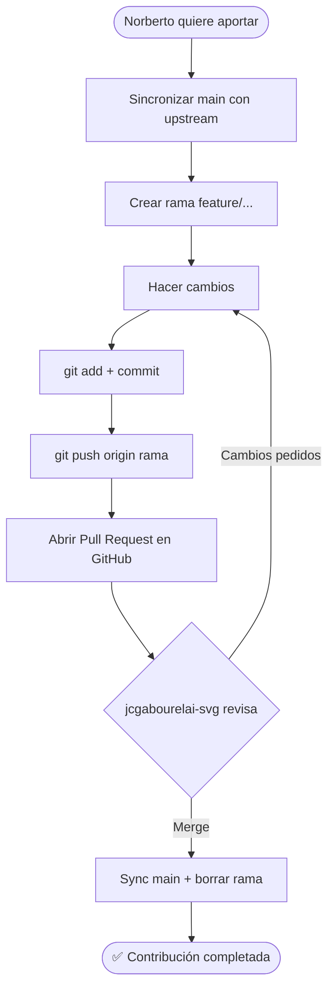

# 📋 Guía de colaboración para Norberto2099

> **Repo original (upstream):** `jcgabourelai-svg/redprint-app`
> **Fork propio (origin):** `Norberto2099/redprint-app`

---

## 🔄 PARTE 1 — Configurar el upstream y actualizar su main

### Paso 0: Verificar el estado actual del fork en GitHub
Antes de tocar nada, entra a `github.com/Norberto2099/redprint-app`. Lo más probable es que veas un aviso bajo el nombre de la rama:

> **"This branch is X commits behind jcgabourelai-svg:main"**

Esto significa que tu fork está atrasado respecto al repo original (por eso vamos a sincronizarlo). Toma nota de ese "X commits behind": al final (Paso 6) comprobaremos que el mensaje desapareció.

### Paso 1: Descartar la rama vacía que creó
```powershell
git checkout main
git branch -D nueva-rama
```
*(Si le da error "branch not found", ya no existe; continúe igual.)*

### Paso 2: Añadir el upstream (solo la primera vez)
```powershell
git remote add upstream https://github.com/jcgabourelai-svg/redprint-app.git
git remote -v    # verificar que ahora aparecen ambos remotos
```

Debería ver:
```
origin    https://github.com/Norberto2099/redprint-app.git
upstream  https://github.com/jcgabourelai-svg/redprint-app.git
```

### Paso 3: Traer los cambios del repo original
```powershell
git fetch upstream
```
*(Esto descarga el estado actual de jcgabourelai-svg pero NO toca sus archivos.)*

### Paso 4: Actualizar su main local
```powershell
# (Ya estás en main desde el Paso 1, pero por seguridad:)
git checkout main

git merge upstream/main
```
Si hay mensaje **"Already up to date"**, significa que ya está sincronizado.

> 💡 Si le saliera un editor pidiendo mensaje de commit (merge), simplemente guarde y cierre:
> - VS Code: `Ctrl+S` → cerrar pestaña
> - Vim: `:wq` + Enter

### Paso 5: Subir el main actualizado a SU fork (Norberto2099)
```powershell
git push origin main
```
*(Actualiza el fork, NO el repo original. Eso es lo correcto.)*

### Paso 6: Verificar en GitHub
Vuelve a entrar a `github.com/Norberto2099/redprint-app`. El aviso **"This branch is X commits behind"** que viste en el Paso 0 debe haber **desaparecido** (o cambiado a *"This branch is up to date with jcgabourelai-svg:main"*). Si así es, la sincronización quedó correcta.

---

## 🔁 PARTE 2 — Flujo para futuras colaboraciones

### 🅰️ Sincronizar ANTES de empezar (siempre)
```powershell
git checkout main
git fetch upstream
git merge upstream/main
git push origin main
```

### 🅱️ Crear una rama nueva para su trabajo
```powershell
git checkout -b feature/nombre-del-cambio
```

**Ejemplos de nombres de rama:**
- `feature/login-oauth`
- `fix/bug-widget-3d`
- `docs/readme-docker`
- `refactor/auth-service`

### 🅲️ Hacer los cambios y confirmarlos
```powershell
# ... editar archivos ...

git status                      # ver qué cambió
git add .                       # añadir todos los cambios
git commit -m "feat: descripción clara del cambio"
```

#### Convención de mensajes de commit
| Prefijo | Uso |
|---|---|
| `feat:` | Nueva funcionalidad |
| `fix:` | Corrección de bug |
| `docs:` | Cambios en documentación |
| `refactor:` | Reorganización de código sin cambio funcional |
| `chore:` | Tareas de mantenimiento |
| `test:` | Añadir o corregir tests |

### 🅳️ Subir la rama a SU fork
```powershell
git push origin feature/nombre-del-cambio
```

### 🅴️ Abrir un Pull Request (PR)
1. GitHub mostrará un banner amarillo en `github.com/Norberto2099/redprint-app`:
   > **"Compare & pull request"** → clic
2. **Importante:** verificar que el PR sea:
   - **base repository:** `jcgabourelai-svg/redprint-app`
   - **base:** `main`
   - **head repository:** `Norberto2099/redprint-app`
   - **compare:** `feature/nombre-del-cambio`
3. Escribir título y descripción del cambio
4. **Create pull request**

El dueño (jcgabourelai-svg) revisará y hará **Merge**. Una vez mezclado, el cambio entra al repo original.

### 🅵️ Después del merge — limpieza
```powershell
git checkout main
git pull upstream main            # traer el cambio ya integrado
git push origin main
git branch -d feature/nombre-del-cambio   # borrar la rama local ya merged
```

---

## 📊 Resumen del flujo completo



---

## 🎯 Reglas de oro para Norberto2099

1. **NUNCA trabaje directo en `main`** — siempre use ramas `feature/`, `fix/`, etc.
2. **NUNCA intente `git push` directo a `jcgabourelai-svg`** — no tiene permiso (y no lo necesita). Todo va por PR desde su fork.
3. **Siempre sincronice `upstream/main` antes de crear una rama nueva** — evita conflictos.
4. **Un cambio = una rama = un PR** — no mezcle features distintas en la misma rama.
5. **Mensajes de commit claros** con prefijo (`feat:`, `fix:`, etc.) — facilita la revisión.

---

## 📎 Cheatsheet de comandos rápidos

```powershell
# === Configuración inicial (una sola vez) ===
git remote add upstream https://github.com/jcgabourelai-svg/redprint-app.git

# === Sincronizar fork (antes de cada aporte) ===
git checkout main
git fetch upstream
git merge upstream/main
git push origin main

# === Flujo de aporte ===
git checkout -b feature/nombre-del-cambio
# ... editar archivos ...
git add .
git commit -m "feat: descripción del cambio"
git push origin feature/nombre-del-cambio
# → Abrir PR en GitHub

# === Limpieza post-merge ===
git checkout main
git pull upstream main
git push origin main
git branch -d feature/nombre-del-cambio
```

---

## 🔧 Solución de problemas comunes

### "Permission denied (publickey)" al hacer push
Las credenciales de Windows están cacheadas con otra cuenta. Solución:
```powershell
# Borrar credenciales de GitHub almacenadas
cmdkey /delete:git:https://github.com
# Luego reintentar el push; pedirá login
git push origin main
```

### "Your branch is ahead of 'origin/main' by N commits"
Tiene commits locales sin subir:
```powershell
git push origin main
```

### Conflictos al hacer merge de upstream
```powershell
git merge upstream/main
# Si marca conflictos:
# 1. Abrir los archivos con conflicto (marcados con <<<<<<<)
# 2. Resolver manualmente
# 3. Continuar:
git add .
git merge --continue
```

### Quiero descartar TODO mi main y dejarlo igual al upstream
⚠️ **Solo si está seguro de perder cambios propios:**
```powershell
git checkout main
git fetch upstream
git reset --hard upstream/main
git push origin main --force
```
