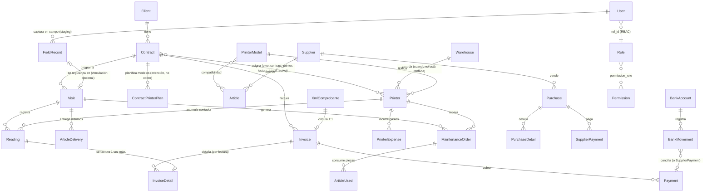

# PROJECT.md — Contexto estratégico y marco de evaluación de RedPrint

> **Para agentes de IA:** este documento es tu **herramienta de evaluación**. No describe cómo
> editar el proyecto (eso está en [`AGENTS.md`](AGENTS.md)) sino **qué es el proyecto, por qué
> está diseñado como está, y cómo juzgar si un cambio, feature o decisión es coherente y
> pertinente**. Léelo completo antes de opinar, sugerir o implementar.
>
> **Para humanos:** es también un buen resumen ejecutivo del sistema: negocio, alcance,
> filosofía, flujos y deuda conocida.

**Última revisión del documento:** 2026-08-28 · **Veracidad:** contrastado contra el código
(backend `app/`, `routes/api.php`, migraciones; frontend `src/`; mobile `src/`). Si el código y
este documento discrepan, **gana el código** — y eso es en sí mismo un hallazgo a reportar.

---

## Índice

1. [El negocio detrás del software](#1-el-negocio-detrás-del-software)
2. [Alcance del sistema](#2-alcance-del-sistema)
3. [Filosofía y principios de diseño](#3-filosofía-y-principios-de-diseño)
4. [Arquitectura y mapa de "dónde mirar"](#4-arquitectura-y-mapa-de-dónde-mirar)
5. [Modelo de dominio esencial](#5-modelo-de-dominio-esencial)
6. [Máquinas de estado e invariantes](#6-máquinas-de-estado-e-invariantes)
7. [Flujos de negocio de extremo a extremo](#7-flujos-de-negocio-de-extremo-a-extremo)
8. [Decisiones clave documentadas (ADRs ligeros)](#8-decisiones-clave-documentadas-adrs-ligeros)
9. [UX: patrones y convenciones](#9-ux-patrones-y-convenciones)
10. [Deuda conocida, mocks y vacíos](#10-deuda-conocida-mocks-y-vacíos)
11. [Marco de evaluación para la IA](#11-marco-de-evaluación-para-la-ia)
12. [Mapa de evidencia](#12-mapa-de-evidencia)

---

## 1. El negocio detrás del software

RedPrint es el sistema de administración de una empresa mexicana de **renta de impresoras con
cobro por consumo** (modelo *cost-per-copy*). La empresa no vende impresoras: instala flotas
en oficinas de clientes bajo contrato, lee periódicamente los contadores de páginas y **cobra
una renta fija más un excedente por página** consumida por encima de las incluidas en el plan.

### Fórmula central del negocio

```
monto a cobrar = tarifa_base + max(0, páginas_del_periodo − páginas_incluidas) × costo_pag_excedente
```

Todo el sistema gira alrededor de esta fórmula: los **contratos** la parametrizan, las
**lecturas de contador** la alimentan, la **facturación** la aplica y la **rentabilidad** la
contrasta contra costos.

### Actores

| Actor | Rol en el negocio | En el sistema |
|---|---|---|
| Administrador / dueño | Decide compras, contratos, precios, finanzas | Rol `administrador` (`es_sistema`, bypass total) |
| Operador de campo ("socio") | Visita clientes, lee contadores, entrega insumos, reporta fallas, instala/retira equipos | Rol `operador` + app móvil `/m/` |
| Operador de inventario | Gestiona almacenes, artículos, impresoras | Rol `operador-inventario` (solo `inventario.*`, es un rol limitado de prueba MVP) |

### Ciclo de vida del negocio en una línea

```
comprar equipos e insumos → almacenar → contratar con clientes → asignar impresoras
→ visitar y leer contadores → facturar consumo → cobrar → conciliar banco → cerrar periodo
   ↳ mantener/reparar equipos (con stock de piezas) → rotar impresoras (instalar/retirar)
```

### Contexto fiscal (México)

- Moneda **MXN** (con soporte USD en cuentas bancarias), RFC de clientes/proveedores.
- **CFDI**: comprobantes fiscales digitales (XML del SAT). Se importan, se casan con clientes
  por RFC y se vinculan 1:1 con facturas internas. Solo CFDI de tipo **ingreso** (`I`) genera
  facturas.

---

## 2. Alcance del sistema

### Dentro del alcance

- **Inventario**: impresoras (catálogo marca/modelo, serie, vida útil, garantía, estado),
  artículos/repuestos (CONSUMIBLE/REPARACION, compatibilidad con modelos, stock y umbral),
  almacenes, kardex de movimientos (ENTRADA/SALIDA/AJUSTE).
- **Clientes y contratos**: alta de clientes, contratos con esquema de cobro
  (tarifa base + páginas incluidas + excedente), asignación/liberación de impresoras,
  frecuencia de visitas (MENSUAL/QUINCENAL/SEMANAL/CUSTOM).
- **Operaciones**: calendario de visitas con **generación automática rolling** (diaria 02:00
  `America/Cancun`), captura de lecturas con detección de anomalías, entregas de insumos,
  instalación/retiro de impresoras.
- **Mantenimiento**: órdenes preventivas/correctivas con piezas usadas (snapshot de costo,
  descargo de stock al completar), gastos por impresora.
- **Finanzas**: facturación por lecturas o manual, pagos y cuentas por cobrar, compras y
  cuentas por pagar, importación/vinculación de CFDI, cuentas bancarias y conciliación,
  cierre de periodo mensual con validaciones, reportes (rentabilidad por impresora/cliente,
  flujo de caja).
- **Sistema**: usuarios con **RBAC granular** (roles + permisos por módulo), notificaciones,
  bitácora de auditoría.
- **App móvil de campo** (`/m/`): "RedPrint Operativo" — día del operador, captura de
  lecturas **con cola offline** (IndexedDB), entrega de insumos, reporte de fallas,
  instalación/retiro.

### Fuera del alcance (decisiones explícitas)

- **No hay emisión/timbrado de CFDI** hacia el SAT: solo importación de XML ya timbrados
  (la empresa timbra con otra herramienta).
- **No hay portal del cliente** ni autorregistro de usuarios.
- **No hay app nativa**: la app "móvil" es una SPA servida en `/m/`.
- **No hay contabilidad electrónica completa** (no es un ERP contable): es gestión operativa
  + financiera orientada al negocio de renta.
- La conciliación bancaria es **manual** (no hay importación de estados de cuenta bancarios).

### Estado real (importante para no sobreestimar)

El sistema es funcional en su núcleo, pero contiene **zonas de prototipo**: pantallas con
datos mock, botones decorativos y selects hardcodeados (detallados en
[§10](#10-deuda-conocida-mocks-y-vacíos)). Al evaluar, distingue siempre **núcleo sólido**
(backend de dominio: contratos, visitas, lecturas, facturación, stock) de **corteza
incompleta** (algunas pantallas de finanzas/sistema).

---

## 3. Filosofía y principios de diseño

Estos principios son el **criterio de aceptación** de cualquier cambio propuesto. Un cambio
que los viola debe justificar explícitamente por qué.

### Principios duros (casi leyes)

1. **El servidor es la única fuente de verdad de cálculos de dinero.** El frontend muestra;
   nunca decide montos. La facturación por lecturas **recalcula en servidor** aunque el
   cliente envíe detalles. Ver `InvoiceService::create` / `InvoiceCalculationService`.
2. **Toda mutación compuesta es transaccional.** Crear contrato (+ asignar impresoras +
   1ª visita), capturar lectura (+ contador), registrar pago
   (+ estado de factura), completar mantenimiento (+ descargo de stock), recibir compra
   (+ entradas), conciliar, cerrar periodo: todo vive en `DB::transaction`. Las reglas de
   negocio violadas se lanzan como `BusinessRuleException` → HTTP **422**.
4. **El historial es evidencia, no se reescribe.** `PrinterHistory` es bitácora inmutable de
   eventos; los movimientos de inventario guardan `stock_anterior`/`stock_posterior`; las
   lecturas son inmutables; los snapshots de costo (entregas, piezas, detalles de compra)
   congelan el precio al momento del hecho. Los periodos cerrados guardan snapshot de KPIs.
5. **Integridad respaldada por la base de datos, no solo por el código.** Unicidades donde el
   negocio lo exige: `numero_factura`, `uuid` de CFDI, `num_serie`/`codigo_negocio` de
   impresora, `numero_cuenta`, `periodo` de cierre, (contrato, impresora) en el pivot, y el
   **índice único parcial sobre `invoice_details.lectura_id`** (una lectura se factura a lo
   sumo una vez).
6. **La existencia de stock se protege con lock pesimista** (`lockForUpdate` en cada
   entrada/salida del kardex) — el stock nunca puede quedar negativo ni perder movimientos.
7. **Acceso por permiso granular, no por página.** Cada endpoint tiene middleware
   `permission:clave`; el menú, las rutas y los widgets del dashboard se filtran con el mismo
   catálogo (`config/permisos.php`). Los roles `es_sistema` pasan todo.
8. **Todo corre en Docker, incluso en desarrollo.** Nginx sirve la SPA (8080); no hay flujo
   habitual de `npm run dev` en el host (ver [`AGENTS.md`](AGENTS.md)).
9. **El idioma del dominio es español.** Columnas (`creado_por`, `fecha_programada`),
   payloads (`correo`, `contrasena`), estados (`EN_ALMACEN`, `RENTADA`), UI completa.
   No traducir el dominio a inglés al agregar código.

### Trade-offs aceptados (saber reconocerlos)

- **Cálculo derivado en lectura, no en consulta masiva**: los saldos (`monto_pagado`,
  `saldo_pendiente`) se mantienen actualizados por servicios, no se recalculan en cada query.
- **Denormalización pragmática**: marca/modelo se copian en `printers`; los estados
  "calculados" de CFDI (conciliado, con cliente) se derivan de relaciones.
- **Mobile offline solo para lecturas**: es la operación crítica del operador (cobro por
  página); el resto requiere conexión. Aceptado para v1.
- **Sin Policies de Laravel**: la autorización es middleware + servicios. Más simple, menos
  granular por registro.

---

## 4. Arquitectura y mapa de "dónde mirar"

```
Producción: Caddy (TLS) ─► Nginx :${APP_PORT:-8080}
                              │
        ┌─────────────────────┼────────────────────┐
        ▼                     ▼                    ▼
   SPA web (/)          Móvil (/m/)         /api/v1 + /sanctum
   frontend/dist        mobile/dist         (dist estáticos)      │
                                                             PHP-FPM (Laravel 11)
                                                              │        │
                                                              ▼        ▼
                                                        PostgreSQL  scheduler
                                                                   (visits:generate-upcoming)
```

- **3 despliegues del mismo backend**: panel web (React), app de campo (React), API REST
  versionada. Auth **Sanctum por cookie** same-origin (misma sesión para web y móvil).
- **Servicios compose**: `frontend` y `mobile` (builders one-shot node:20), `app` (Laravel +
  PHP-FPM, entrypoint auto-bootstrap), `scheduler` (`schedule:work`), `database` (PostgreSQL
  16), `nginx` (sirve `/`, `/m/`, enruta `/api`).

### Mapa de dónde mirar (por tipo de pregunta)

| Quiero entender/juzgar… | Mirar en |
|---|---|
| Una regla de negocio | `backend/app/Services/*.php` (lógica), `app/Http/Controllers` (orquestación delgada) |
| El modelo de datos / constraints | `backend/database/migrations/` (columnas en español, enums nativos en tablas de banca) |
| Estados y transiciones | `backend/app/Enums/*.php` + servicios correspondientes |
| Endpoints y permisos por ruta | `backend/routes/api.php` + `backend/config/permisos.php` |
| Lógica de generación de visitas | `app/Services/VisitSchedulerService.php` + `routes/console.php` |
| Cálculo de facturación | `app/Services/InvoiceCalculationService.php`, `InvoiceService.php` |
| Importación CFDI | `app/Services/CfdiService.php`, `app/Services/Cfdi/CfdiParser.php` |
| Rentabilidad / flujo de caja | `app/Services/ProfitabilityService.php`, `CashFlowService.php` |
| Navegación y permisos en UI | `frontend/src/config/nav.ts`, `frontend/src/App.tsx` |
| Etiquetas/colores de estados en UI | `frontend/src/types/enums.ts` (+ mapas `*Labels`) |
| Patrones de listado/tabla | `frontend/src/hooks/useServerTable.ts`, `components/ui/Table.tsx` |
| Cola offline móvil | `mobile/src/lib/sync.ts`, `lib/db.ts` (IndexedDB `redprint_mobile`) |
| Datos demo (qué existe sembrado) | `backend/database/seeders/` |

---

## 5. Modelo de dominio esencial

Diagrama de relaciones principales (≠ esquema completo; ver migraciones para detalle):



### Entidades que debes dominar para opinar

| Entidad | Idea central | Dato no obvio |
|---|---|---|
| **Contract** | El corazón del negocio: precio (tarifa base/incluidas/excedente), frecuencia de visita, estado | `calculateEstimatedAmount()` es la fórmula del §1; atributos `ingresos`/`costos`/`rentabilidad`/`margen` |
| **ContractPrinter** (pivot) | Asignación impresora↔contrato | Guarda `lectura_inicial` (base de cálculo del primer periodo) y `activa` |
| **ContractPrinterPlan** | Plan de modelos contratados (intención comercial, sin series) | **Nunca es fuente de cobro** (D16); puro `printer_model_id` × `cantidad` (sin alias: el alias nace en la instalación, en el pivot); la instalación real nace al vincular la serie (móvil) |
| **Visit** | Unidad de trabajo de campo | `tipo_visita` es **motivo**, no restricción de acciones; `origen=CAMPO` si se creó desde el móvil; `motivo_cierre` obligatorio si se cierra sin actividades |
| **Reading** | El dato que genera ingresos | `paginas_periodo` = contador − lectura previa (o `lectura_inicial`, o 0); retroceso ⇒ anomalía con justificación obligatoria |
| **Invoice / InvoiceDetail** | Cobro por periodo | Detalle por lectura con distribución proporcional del monto del contrato (redondeo absorbido en la última fila) |
| **Article / InventoryMovement** | Stock con kardex | Snapshot de stock en cada movimiento; referencia polimórfica a compra/mantenimiento/entrega |
| **XmlComprobante** | CFDI importado del SAT | Match de cliente por RFC exacto (nunca crea clientes); auto-enlace por serie+folio |
| **PeriodClose** | Cierre mensual | Snapshot de KPIs + 3 validaciones; **no bloquea escritura** del periodo |
| **PrinterHistory** | Bitácora inmutable | Toda transición de estado de impresora deja evento |
| **FieldRecord** | Registro de campo (staging): visita no catalogada (cliente/impresora fuera de sistema) con datos crudos + evidencia (foto/GPS/`capturado_en`) | Capturar ≠ registrar: se regulariza desde la bandeja web (visita + lectura + entregas en una transacción); al regularizar se **reutiliza** la visita PENDIENTE programada del mismo contrato y fecha exacta (`capturado_en`) si existe —si no, se crea una visita `origen=CAMPO` ya completada—; VINCULADO/DESCARTADO son **inmutables**; dedup idempotente por `client_uuid`; la salida de stock nace solo al vincular |

### Glosario mínimo (español del dominio)

**Socio** = técnico/operador asignado a una visita. **Lectura** = valor del contador de páginas.
**Kardex** = historial de movimientos de inventario. **CFDI** = comprobante fiscal XML (SAT,
México). **Serie/folio** = número del CFDI (equivale a `numero_factura`). **Cuentas por
cobrar/pagar** = facturas/compras con saldo pendiente. **Cierre de periodo** = corte mensual
de KPIs. **Impresora rentada / en almacén / en mantenimiento / dada de baja** = estados de la
flota.

---

## 6. Máquinas de estado e invariantes

Las máquinas de estado son el **esqueleto de coherencia** del sistema. Cualquier feature que
toque una entidad con estado debe respetar (o ampliar explícitamente) su máquina.

### Impresora — `EN_ALMACEN → RENTADA → EN_MANTENIMIENTO → DADA_DE_BAJA`

- Solo se asigna a contrato desde `EN_ALMACEN` y si no tiene contrato activo.
- `RENTADA` no se da de baja: primero se libera al almacén.
- Mantenimiento **correctivo** guarda `estado_anterior_impresora` y lo restaura al
  terminar/cancelar; el preventivo no cambia el estado.
- Desde `DADA_DE_BAJA` no hay transiciones. Toda transición escribe `PrinterHistory`.
- Eliminación física (`/force`) solo si `esEliminable()`: sin lecturas, órdenes, gastos,
  contratos ni detalles de factura. La operación normal del día a día es la **baja**.

### Contrato — `ACTIVO / SUSPENDIDO / FINALIZADO / CANCELADO`

- Nace `ACTIVO` y genera su **primera visita en la misma transacción**.
- `FINALIZAR`/`CANCELAR` cancelan visitas PENDIENTES futuras y liberan todas las impresoras
  activas a un almacén.

### Visita — `PENDIENTE / COMPLETADA / REPROGRAMADA / CANCELADA / OMITIDA`

- Completar exige **actividad** (lectura, entrega, orden, cambio de impresora) **o motivo
  explícito**. **Sin autocierre**: ni lecturas ni instalación/retiro cierran la visita;
  el cierre es siempre explícito (excepción: la regularización de registros de campo
  cierra visita en la misma transacción — si hay visita PENDIENTE programada del mismo
  contrato en la fecha exacta del registro la **reutiliza** (actualiza `socio_id` y
  anota el marcador, sin tocar `tipo_visita`/`origen`/`fecha_programada`); si no,
  crea su visita `origen=CAMPO` ya completada).
- Semántica clave (frecuentemente malentendida): **OMITIDA** = eliminación manual del slot,
  **bloquea la regeneración** del scheduler; **CANCELADA** = cancelación contractual,
  **permite regenerar** si el contrato se reactiva.
- `COMPLETADA`/`CANCELADA`/`OMITIDA` son inmutables (422 si se intenta modificar).

### Mantenimiento — `PROGRAMADA → COMPLETADA | CANCELADA` (soft deletes)

- Piezas solo en `PROGRAMADA`. Completar = calcular `costo_total` (mano de obra + piezas) +
  **descargar stock** + restaurar impresora. Cancelar borra piezas **sin tocar stock**.

### Factura — `PENDIENTE → PARCIALMENTE_PAGADA → PAGADA` (+ `VENCIDA`, `INCOBRABLE`)

- Cada pago (0 < monto ≤ saldo) actualiza montos y estado automáticamente.
- `VENCIDA` se marca por fecha de vencimiento vía `checkOverdue()` (**no hay scheduler** que
  lo corra solo). `INCOBRABLE` es terminal pero **sin transición implementada en servicios**.

### Compra — `PENDIENTE → RECIBIDA | CANCELADA`

- Solo al **recibir** se ingresan los detalles con artículo al stock. No se cancela una
  compra recibida.

### CFDI (derivado) y banca

- CFDI: `sin_cliente/asignado` (por receptor RFC) × `sin_factura/conciliado` (por enlace 1:1
  con factura). Solo tipo `I` genera/vincula facturas. Importación idempotente por `uuid`.
- Movimiento bancario: `PENDIENTE → CONCILIADO` al enlazarlo con un `Payment` o
  `SupplierPayment`.
- Periodo: `abierto → cerrado` (único por `Y-m`), con 3 validaciones (facturas pendientes,
  conciliación pendiente, rentabilidad negativa = error bloqueante).

### Invariantes resumen (lo que jamás debe romperse)

1. Una lectura se factura **a lo sumo una vez** (índice único parcial + captura de 23505).
2. Una factura se vincula a **a lo más un** CFDI y viceversa (unique en ambos lados).
3. Un CFDI se importa una vez (`uuid` único; duplicado ⇒ estado `duplicado`, no error).
4. El stock no baja de cero (locks + validación de existencia).
5. `monto_pagado ≤ monto_total` siempre (no hay sobrepagos).
6. Una impresora no está activa en dos contratos a la vez.
7. `Σ detalles == monto_total` en facturas por lecturas (redondeo absorbido).
8. Visitas completadas/canceladas/omitidas no se modifican.
9. Una lectura con contador a la baja exige justificación (`es_anomalia`).

---

## 7. Flujos de negocio de extremo a extremo

### Flujo maestro: contrato → lectura → factura → cobro

```mermaid
sequenceDiagram
    participant A as Admin (web)
    participant S as Scheduler (02:00)
    participant O as Operador (móvil /m/)
    participant API as API Laravel

    A->>API: POST /contracts (wizard 4 pasos)
    API-->>A: CTR-NNNN ACTIVO + impresoras RENTADA + 1ª visita
    Note over A,API: El alta puede llevar plan de modelos sin series (D16);<br/>el operador vincula la serie real y captura la lectura_inicial<br/>(contador físico) al instalar desde la app móvil.
    S->>API: visits:generate-upcoming (rolling 1 mes)
    O->>API: GET /visits (Hoy / Calendario)
    O->>API: POST /readings (con foto/GPS, cola offline si no hay red)
    API-->>O: paginas_periodo + monto_estimado (la visita se cierra de forma explícita)
    A->>API: GET /invoices/calcular (estimación + advertencias)
    A->>API: POST /invoices (servidor recalcula; index unique evita doble facturación)
    A->>API: POST /payments (monto ≤ saldo; estados automáticos)
    A->>API: reconciliation/link (movimiento bancario ↔ pago)
    A->>API: period/close (validaciones + snapshot; irreversible)
```

Puntos de evaluación del flujo maestro: ¿la estimación coincide con lo cobrado? ¿las
advertencias de la estimación (lecturas sin contrato, contratos sin lecturas) se resuelven o
se ignoran? ¿el ciclo cierra sin intervention manual?

### Flujos secundarios

1. **Compra → stock → mantenimiento**: compra PENDIENTE → recibir (entrada kardex) → pieza
   usada en orden PROGRAMADA (snapshot costo) → completar orden (salida kardex + costo_total)
   → costos alimentan rentabilidad de contrato/impresora.
2. **CFDI → factura**: importar XML (idempotente, anti-XXE) → auto-match cliente por RFC →
   generar factura desde CFDI (tipo I) o vincular a factura existente por serie+folio →
   pagar → conciliar.
3. **Rotación de flota**: retiro (contrato → almacén, estado `EN_ALMACEN`) / instalación
   (almacén → contrato, `RENTADA`, nueva `lectura_inicial`), ambos desde el móvil durante una
   visita (quedan estampados en `printer_histories` con `visita_id`; **sin autocierre**: la
   visita se cierra de forma explícita, lo que permite seguir capturando actividades —p. ej.
   entrega de tóner— en la misma visita).
4. **Cierre mensual**: validaciones previas (bloquea errores) → snapshot KPIs → historial de
   periodos. Nota: el cierre **no congela escritura** de periodos pasados.

---

## 8. Decisiones clave documentadas (ADRs ligeros)

Formato: decisión → racional → implicación al evaluar. Úsalo para juzgar si un cambio
propuesto contradice una decisión consciente (malo) o corrige una omisión (bueno).

| # | Decisión | Racional | Al evaluar |
|---|---|---|---|
| D1 | **Facturación recalculada en servidor** | No confiar montos del cliente; evitar manipulación/desync | Cualquier cálculo de dinero nuevo debe vivir en backend |
| D2 | **OMITIDA ≠ CANCELADA en visitas** | Distinguir "el operador saltó el slot" (no regenerar) de "el contrato terminó" (regenerable) | Cambios en scheduler deben preservar ambas semánticas |
| D3 | **Snapshot de costos en entregas/piezas/compras** | El precio cambia; el hecho histórico no | Nunca "recalcular" histórico desde precios actuales |
| D4 | **CFDI match por RFC exacto, sin crear clientes** | Un CFDI con RFC desconocido es señal de datos sucios, no algo que auto-resolver | Nuevas fuentes de match deben ser explícitas para el usuario |
| D5 | **Solo lecturas offline en móvil** | La lectura es la operación crítica y de mayor frecuencia; el resto es menos urgente | Ampliar offline (p.ej. entregas) es válido pero debe mantener la clasificación de errores del SyncManager |
| D6 | **Doble validación de anomalías (cliente + servidor)** | El móvil puede tener `lectura_anterior` desactualizada | El servidor sigue siendo árbitro |
| D7 | **Baja ≠ eliminación de impresora** | Conservar historia fiscal/operativa | Eliminar es operación excepcional con guard `esEliminable()` |
| D8 | **Scheduler rolling de 1 mes, idempotente** | Evitar regeneración masiva/duplicada; guard anticopia por (contrato, cliente, fecha) | Cambios de frecuencia/horizonte deben razonar sobre idempotencia |
| D9 | **RBAC por permiso granular (20 claves / 6 módulos)** | Menú y API comparten catálogo | Nueva feature ⇒ decidir permiso nuevo o reutilizar |
| D10 | **UI 100% español (México), formatos es-MX/MXN** | Usuarios finales mexicanos | No introducir textos en inglés ni formatos gringos |
| D11 | **Auth Sanctum por cookie same-origin** | Simplifica web+móvil bajo un dominio | Rompe si se separan dominios de API y SPA (hoy aceptado) |
| D12 | **Estados calculados de CFDI en vez de columnas** | Menos sincronización manual | Evaluar si escala (filtros/contadores derivan de relaciones) |
| D13 | **Cierre de periodo como snapshot informativo** | Cerrar rápido, sin bloquear operación | Pregunta abierta: ¿debería congelar? (ver §11.2) |
| D14 | **Build de frontends que vacía `dist` sin borrar la carpeta** | Bind mount de nginx en Windows/OneDrive se rompe si cambia el inodo | No cambiar por `rm -rf dist` (detalles en AGENTS.md) |
| D15 | **Registros de campo: staging móvil + regularización web diferida** | El contrato toca dinero y la impresora toca catálogo: no se dan de alta desde el móvil (extiende D4/D5). El hecho físico se captura como evidencia cruda y un admin la vincula a entidades reales en una sola transacción | Al vincular, instalación implícita con `lectura_inicial = contador capturado` (línea base, no se cobra histórico previo) y la salida de stock (kardex) nace solo ahí; los registros vinculados/descartados son inmutables. Anti-duplicidad: los registros LECTURA/ENTREGA **reutilizan por fecha exacta** la visita PENDIENTE programada del mismo contrato (`capturado_en->toDateString()`); los OTRO siempre crean visita nueva (tipo+motivo explícitos); el scheduler no regenera el slot consumido |
| D16 | **Plan de modelos ≠ asignación: el plan nunca es fuente de cobro** | Separar la intención comercial (qué modelos se contratan, `contract_printer_plan`) del hecho físico (qué serie queda instalada, pivot `contract_printer`). La `tarifa_base` corre desde `fecha_inicio` aunque falte instalar; el binding diferido solo traslada cuándo empieza a contar páginas (desde la `lectura_inicial` capturada en campo) | Cualquier cálculo de dinero debe seguir leyendo el pivot (nunca el plan); el plan solo alimenta visibilidad (`pendientes_instalacion`, badge) y advertencias de estimación; `PUT /contracts/{id}/plan` solo en ACTIVO y replace-all |

---

## 9. UX: patrones y convenciones

El frontend tiene convenciones fuertes; una feature que no las siga se percibe rota.

1. **Anatomía de listado**: `PageLayout` con título tipo migas (`"Módulo › Submódulo"`) →
   encabezado + botón primario (a veces solo admin) → KPIs (finanzas) → filtros plegables →
   `EmptyState` **solo si no hay filtros activos**, si no tabla con "No se encontraron X con
   los filtros aplicados" → click de fila navega al detalle.
2. **Anatomía de detalle**: botón "Volver" + acciones admin a la derecha; fichas en Cards;
   sección secundaria en Tabs; columna lateral con métricas y colores semánticos.
3. **Modal para entidades simples, wizard con pasos para flujos con consecuencias**
   (contrato: 4 pasos; factura: 3 pasos). Los wizards terminan en resumen + confirmación que
   **advierte efectos** ("las impresoras pasarán a RENTADA…").
4. **Destructivos con copy honesto**: modal danger con consecuencias; distinción
   baja/eliminación; checkbox de aceptación en cierre de periodo; botón deshabilitado si hay
   validación con error.
5. **Feedback**: `Toast` local success/error; `parseApiError` traduce 401/403/404/422 de
   Laravel a español (aplana errores de validación).
6. **Tablas server-side** vía `useServerTable` (search con debounce 350 ms, sort, filtros,
   paginación `page/per_page/search/sort_by/sort_dir`); `placeholderData` anti-flash.
7. **Estados con Badge semántico** mapeados desde `frontend/src/types/enums.ts`
   (`XLabels` + colores). Cada estado nuevo necesita etiqueta y color.
8. **Dark mode por tokens** (claro/oscuro/sistema, persistido, sync multi-pestaña) y
   **responsive real** (drawer + BottomNav curada en móvil).
9. **Permisos como eje de UI**: rutas con `RequirePermission`, menú filtrado, widgets del
   dashboard ocultos sin permiso, acciones de escritura usualmente `isAdmin`.
10. **Cálculo en vivo en capturas**: la captura de lecturas muestra páginas y monto estimado
    al teclear; la factura por lecturas consulta el cálculo al servidor y muestra
    advertencias.

Móvil: navegación inferior (Hoy/Visitas/Alertas/Perfil), indicador de sincronización flotante
(⟳) con panel de la cola (pendientes/errores, reintentar/descartar), flujos cortos de una
pantalla por acción, doble validación de anomalía.

---

## 10. Deuda conocida, mocks y vacíos

**Catálogo honesto de lo que NO está terminado.** Úsalo para no confundir bug con mock, y
para detectar sugerencias de "terminar lo empezado" (suelen ser de alto valor).

### Backend

- `InventoryService::generateLowStockNotification` consulta `users.rol='ADMIN'` (columna
  legacy string) que **coexiste con el RBAC actual** (`rol_id`): las notificaciones de stock
  bajo podrían no llegar a los admins reales.
- `PeriodController` cuenta movimientos "conciliados/pendientes" por `tipo` en vez de
  `conciliacion_status` — posible bug latente en el resumen de cierre.
- **No hay scheduler** para: marcar facturas vencidas (`checkOverdue` existe pero se invoca
  ad hoc), notificaciones de stock bajo, ni cierres automáticos.
- Enums `UserRole` y `BasePolicy` existen pero no se usan en el flujo real (autorización real
  = middleware + `tienePermiso`).
- `Client.estado`/`saldo_pendiente` son atributos calculados con potencial N+1 en listados.

### Frontend (mocks y botones decorativos)

- Campana de notificaciones del Header: badge **"3" hardcodeado** y contenido mock.
- `ConfigPage` opera solo sobre `localStorage` (no hay backend de preferencias).
- Selects hardcodeados: proveedores/artículos en compras, cuentas/periodos en conciliación,
  socios en lecturas; reportes con datos `mockTrend`/`mockIncomeBreakdown`.
- Botones sin handler: "Imprimir" (visita), "Eliminar" (facturas), "Ver Reporte/Enviar email"
  (conciliación), "Ver todas las notificaciones".
- Eliminaciones de usuarios/notificaciones son solo de estado local (`setUsers`) sin mutación
  al backend.
- `zustand`, `react-hook-form`, `zod` instalados pero **sin uso** (formularios = useState +
  validación manual).
- `fecha_inicio` por defecto fija (`2026-05-15`) en el wizard de contrato.
- Tildes inconsistentes en zonas nuevas (`Administracion`, `Conciliacion` vs `Artículos`).

### Móvil / integridad

- **Sin unicidad server-side por (visita, impresora) en lecturas**: un sync duplicado
  (reintento tras timeout ambiguo) puede crear lectura doble; la dedup es solo client-side.
  Los **registros de campo SÍ resuelven este hueco**: dedup idempotente server-side por
  `client_uuid` (`FieldRecordService::create`).
- Offline: lecturas y registros de campo (ambos por la cola del `SyncManager`); sin service
  worker/PWA (la navegación offline no funciona).
- La **regularización de registros de campo es web-only**: el móvil solo captura; vincular a
  cliente/contrato/impresora y descartar viven en "Operaciones › Registros de campo".
- Completar la orden correctiva queda solo en el panel web (el móvil solo la crea).
- `tipo_visita` es motivo, no restricción: todas las acciones están disponibles en cualquier
  visita editable.

---

## 11. Marco de evaluación para la IA

Esta sección es la **caja de herramientas** que pediste: protocolos, checklists y preguntas
para juzgar coherencia y pertinencia. Úsala como método de trabajo, no como decoración.

### 11.1 Protocolo general de evaluación

1. **Ubica el cambio en el mapa**: ¿qué módulo, qué entidad, qué máquina de estado, qué
   permiso?
2. **Clasifica la zona**: ¿núcleo de dominio (§2 estado real) o corteza incompleta? El rigor
   exigible es distinto.
3. **Contrasta contra invariantes (§6)**: ¿las preserva, las relaja conscientemente o las
   rompe por accidente?
4. **Contrasta contra decisiones (§8)**: ¿contradice una decisión racionalizada (malo) o
   cubre una omisión/deuda de §10 (bueno)?
5. **Sigue el dinero y el stock**: todo cambio que toque facturación, pagos, lecturas o
   inventario debe razonar sobre transacciones, locks y unicidades.
6. **Evalúa las 3 superficies** (web, móvil, API): un cambio de backend con impacto móvil
   que no actualiza `/m/` es una sugerencia incompleta.
7. **Verifica en el código** las afirmaciones clave (mapa §12) antes de asegurarlas.

### 11.2 Checklist de coherencia (structural)

Marcar ✅/❌/⚠️ con evidencia (`archivo:línea`). Ideal para revisiones periódicas:

- [ ] Cada estado de cada enum de `backend/app/Enums` tiene etiqueta y color en
      `frontend/src/types/enums.ts`.
- [ ] Cada `NavItem.permiso` de `frontend/src/config/nav.ts` existe en
      `backend/config/permisos.php`.
- [ ] Cada ruta de `frontend/src/App.tsx` con `RequirePermission` tiene endpoint protegido
      con el mismo permiso en `routes/api.php` (y viceversa: endpoints sin UI = deuda o
      móvil).
- [ ] Cada acción del móvil (`mobile/src/pages`) llama a un endpoint que existe y que el
      permiso requerido es coherente con el que gobierna la pantalla.
- [ ] Toda mutación compuesta de servicios usa `DB::transaction` (grep
      `DB::transaction` vs servicios con escrituras múltiples).
- [ ] Toda escritura de stock pasa por `InventoryService` y deja movimiento kardex (nadie
      hace `->update(['stock' ...])` directo).
- [ ] Toda pantalla de dinero muestra montos vía `formatCurrency` (es-MX/MXN).
- [ ] Cada nueva tabla tiene sus índices/unicidades de negocio, no solo FKs.
- [ ] Las listas paginan server-side (no hay `GET` sin `per_page` que el móvil deba
      "fetchAll"-ar infinito).
- [ ] Los textos nuevos del frontend/móvil están en español y con tildes correctas.
- [ ] No hay cálculo de dinero nuevo implementado solo en el cliente.

### 11.3 Preguntas de pertinencia de negocio

Para juzgar si el **modelo de negocio** está bien servido por el sistema:

1. **Cobertura de costos**: ¿la rentabilidad por contrato/impresora incluye **costo de
   insumos entregados** (tóner), o solo mantenimiento + gastos? ¿el costo por página real
   (tóner/pieza ÷ rendimiento) se conoce? *(Verificar en `ProfitabilityService` antes de
   responder.)*
2. **Vencidos**: sin scheduler de `checkOverdue`, ¿el estado VENCIDA es confiable? ¿debería
   haber recordatorios de cobranza?
3. **Doble lectura por sync ambiguo** (§10 móvil): ¿cuál sería el impacto financiero de
   facturar una lectura duplicada? ¿vale un unique index por (visita, impresora)?
4. **Cierre sin congelamiento**: se puede editar un periodo ya cerrado (pagos, facturas) y el
   snapshot queda desfasado. ¿Es aceptable para el tamaño del negocio? ¿Cuándo dejaría de
   serlo?
5. **Notificaciones de stock bajo** no llegan a admins reales (bug legacy `users.rol`).
   ¿Qué operaciones de campo dependen de ese aviso?
6. **Fórmula de rentabilidad** del cierre: `(ingresos−egresos)/egresos×100` — ¿es la
   métrica que el dueño espera (sobre egresos, no sobre ingresos)? ¿es consistente con
   `margen` de contratos?
7. **Egresos del flujo de caja** incluyen `Purchases` al (¿fecha de compra o de pago?).
   ¿coincide con la lógica de caja que usa el contador?
8. **CFDI de egreso** (tipo E, facturas de proveedores): hoy solo se importan/consultan.
   ¿La conciliación de cuentas por pagar con CFDI de proveedor es una necesidad real?
9. **Crecimiento**: ¿qué se rompe primero con 50 operadores / 500 contratos / 10k lecturas
   al mes? (pistas: N+1 de clientes, paginación móvil `fetchAll` con tope 10 páginas,
   generación de visitas en chunks de 200).
10. **Multi-moneda**: cuentas en USD pero facturación MXN — ¿hay exposición cambiaria que el
    sistema deba reflejar?

### 11.4 Preguntas de pertinencia de UX

1. ¿El usuario de cada pantalla está definido (admin vs operador)? ¿Las acciones de escritura
   están consistentemente restringidas (hoy: mezcla de `isAdmin` y permisos)?
2. ¿Los flujos de alto riesgo terminan en confirmación con consecuencias explícitas (patrón
   wizard §9.3)? ¿Algún flujo riesgoso lo salta?
3. ¿Algún botón visible es mentira (mock/sin handler)? Listar y priorizar (§10 los conocidos;
   buscar nuevos).
4. ¿Los estados vacíos enseñan el siguiente paso (CTA) o solo dicen "no hay nada"?
5. ¿Los errores 422 del backend se muestran accionables (campo + acción) o como toast
   genérico?
6. ¿La app móvil puede funcionar en el escenario real (bodega sin señal → cola de lecturas →
   sincronizar al volver)? ¿Qué pasa si el operador captura con la sesión vencida?
7. ¿La carga cognitiva de las pantallas de finanzas es apta para el usuario real
   (contador/administrador, no un analista)?
8. Consistencia terminológica UI ↔ dominio: ¿se dice "socio", "visita", "lectura" igual en
   web, móvil y reportes?

### 11.5 Catálogo de smells específicos del proyecto

Señales de problemas que **en este códigobase** suelen indicar deuda real:

| Smell | Dónde buscar | Qué suele significar |
|---|---|---|
| Montos calculados en componentes React | `frontend/src/pages/**` (reducer/`reduce(` sobre montos) | Riesgo D1: mover a servidor |
| `->update([` sobre `stock`, `saldo`, `estado` fuera de servicios | `backend/app/**` | By-pass de invariantes (kardex, transiciones) |
| Escritura múltiple sin `DB::transaction` | Servicios nuevos | Parcialidad ante error |
| Endpoint sin middleware `permission:` | `routes/api.php` | Hueco de autorización |
| Permiso mencionado en UI que no existe en catálogo | nav.ts / App.tsx vs `config/permisos.php` | Toggle inútil / 403 confuso |
| `mock*`, `hardcode`, badge fijo | `frontend/src/**` | Pantalla de prototipo (§10) |
| `window.confirm` para destructivos | `frontend/src/**` | Debajo del estándar UX del proyecto |
| Enum nuevo sin `*Labels` ni color | `types/enums.ts` | Estado "gris" en la UI |
| Cambio de schema sin migración | PRs que editan Models/Enums sin archivo en `migrations/` | Drift código ↔ BD |
| Fetch masivo con `fetchAll` para datos crecientes | `mobile/src/**` | Tope 10 páginas silencioso |
| Query de `users` por columna `rol` legacy | `backend/app/Services/**` | Notificaciones a nadie (bug §10) |

### 11.6 Plantilla para sugerencias estructuradas

Toda sugerencia de mejora que emitas debería poder completar esta plantilla (si un campo no
aplica, decir por qué):

```markdown
### Sugerencia: <título>
**Tipo:** negocio | UX | arquitectura | seguridad | deuda
**Problema/objetivo:** <qué se observa o necesita, con evidencia archivo:línea>
**Zona:** núcleo de dominio | corteza/prototipo
**Invariantes tocadas (§6):** <lista o "ninguna">
**Decisiones tocadas (§8):** <D-numeros o "ninguna"; ¿contradice o extiende?>
**Superficies afectadas:** backend | migración | frontend | móvil | scheduler
**Riesgo si no se hace:** <costo de negocio/técnico>
**Riesgo si se hace mal:** <qué puede romperse>
**Verificación:** <tests a agregar/ejecutar; comando concreto>
**Prioridad sugerida:** alta | media | baja — <criterio (dinero > integridad > UX > estética)>
```

Priorización sugerida por defecto: **integridad de dinero y stock > pérdida de datos >
cobertura del flujo de negocio > UX > estética/refactor**.

### 11.7 Verificaciones rápidas (comandos)

```bash
# Tests del backend (PHPUnit)
docker compose exec app php artisan test

# Lint frontend / móvil (solo si se piden)
docker compose run --rm --no-deps frontend sh -c "npm run lint"
docker compose run --rm --no-deps mobile   sh -c "npm run lint"

# Regenerar visitas a mano (probar scheduler)
docker compose exec app php artisan visits:generate-upcoming

# Buscar violaciones de smells (desde la raíz del repo)
rg -n "->update\(\[" backend/app --glob '!**/Services/*'   # escrituras fuera de servicios
rg -n "mock|hardcode" frontend/src mobile/src               # zonas de prototipo
rg -n "users.rol|->rol\b" backend/app/Services              # usos de columna legacy
```

*(Los comandos de rg pueden requerir ajuste de rutas/globs; son heurísticas, no verdades.)*

---

## 12. Mapa de evidencia

Índice de "afirmación de este documento → dónde verificarla":

| Afirmación | Evidencia |
|---|---|
| Fórmula de precio | `backend/app/Models/Contract.php::calculateEstimatedAmount`, wizard `frontend/src/pages/contracts/CreateContract` |
| Recalculo server-side de facturas | `backend/app/Services/InvoiceService.php`, `InvoiceCalculationService.php` |
| Índice único parcial lectura↔detalle | migración de `invoice_details` en `backend/database/migrations/` |
| Máquinas de estado | `backend/app/Enums/*` + servicios (`PrinterService`, `ContractService`, `VisitService`, `MaintenanceService`, `PaymentService`, `PurchaseService`) |
| Scheduler rolling | `backend/app/Services/VisitSchedulerService.php`, `backend/routes/console.php` |
| OMITIDA vs CANCELADA | `VisitService` + `VisitSchedulerService` (guard anticopia) |
| Cola offline móvil | `mobile/src/lib/sync.ts`, `lib/db.ts`, README de `mobile/` |
| Catálogo de permisos | `backend/config/permisos.php` (20 claves / 6 módulos) |
| Registros de campo (staging + bandeja) | `backend/app/Services/FieldRecordService.php`, bandeja `frontend/src/pages/operations/fieldrecords/`, captura `mobile/src/pages/NewFieldRecordPage.tsx` |
| Plan de modelos (D16) | `backend/app/Models/ContractPrinterPlan.php`, migración `2026_08_28_200000_create_contract_printer_plan_table.php`, `ContractService::updatePlan`, wizard `CreateContract.tsx` (paso 2), instalación con plan `mobile/src/pages/InstallationPage.tsx` |
| Mocks del frontend | §10 + grep `mock` en `frontend/src/pages/finance`, `components/layout/Header.tsx` |
| Bug legacy `users.rol` | `backend/app/Services/InventoryService.php::generateLowStockNotification` |
| Resumen de cierre por `tipo` | `backend/app/Http/Controllers/PeriodController.php` |

---

*Cómo mantener este documento: al cambiar una decisión de las de §8, una máquina de estados
o descubrir nueva deuda, actualizar la sección correspondiente. Es un activo del proyecto:
su valor decae si miente.*
