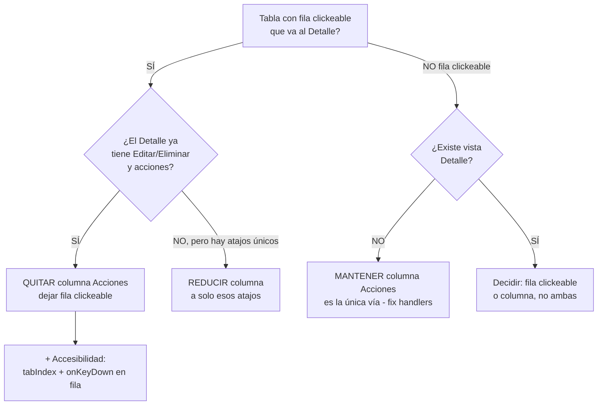

# Análisis: Redundancia entre filas clickeables y columna "Acciones"

> **Objetivo:** Inventario de todas las vistas "Lista" que contienen una `<Table>`,
> comparar los botones de su columna "Acciones" contra (a) el click en la fila y
> (b) las acciones disponibles en la vista "Detalle", y emitir una recomendación
> por módulo: **quitar la columna**, **reducirla** o **mantenerla**.
>
> Fecha: 2026-06-29 · Alcance: `frontend/src/pages/**`

---

## 1. Resumen ejecutivo

| # | Módulo | Fila clickeable | Col. Acciones | Vista Detalle | Veredicto |
|---|--------|:---:|---|:---:|---|
| 1 | **Almacenes** | ✅ → detalle | ~~`👁 Ver`, `✏️ Editar`, `🗑 Eliminar`~~ | ✅ (Editar + Eliminar) | ✅ **Hecho** — columna quitada; fila clickeable → detalle |
| 2 | **Impresoras** | ✅ → detalle | ~~`⋮` **muerto**~~ | ✅ (Editar / Eliminar / Dar de baja) | ✅ **Hecho** — columna muerta quitada; fila clickeable → detalle |
| 3 | **Movimientos** | ✅ → modal | ~~`👁 Ver` **muerto**, `🗑 Eliminar` **muerto**~~ | ✅ (modal solo-lectura) | ✅ **Hecho** — lista reconstruida al esquema real del API, columna "Acciones" muerta quitada, fila clickeable → modal de solo lectura, "Nuevo Movimiento" eliminado (sin backend). a11y de teclado pospuesta (§5.3). |
| 4 | **Mantenimiento** | ✅ → detalle | ~~`👁 Ver` (= click fila)~~ | ✅ (Editar / Completar / Cancelar / Eliminar) | ✅ **Hecho** — columna quitada; fila clickeable → detalle |
| 5 | **Artículos** | ✅ → detalle | ~~`⋮` **muerto**~~ | ✅ (Dar de baja) | ✅ **Hecho** — columna muerta quitada; fila clickeable → detalle |
| 6 | **Compras** | ✅ → detalle | `👁 Ver`(dup), `+ Recibir`(dup), `$ Pago`(**muerto**), `🗑 Cancelar`(dup+bug) | ✅ (Recibir / Cancelar) | **Quitar columna** — todo duplica o está roto |
| 7 | **Cuentas por Cobrar** | ❌ | `👁 Historial`(modal), `$ Cobro`(modal, no persiste) | ❌ NO existe | **Mantener** — única vía (cablear API) |
| 8 | **Pagos (por pagar)** | ❌ | `👁 Ver` **muerto** (modal existe pero inalcanzable) | ❌ NO existe | **Reducir/Implementar** — cablear modal o quitar |
| 9 | **Facturas** | ❌ | `👁 Ver`(**ruta rota→/**), `$ Pago`(modal, no persiste), `🗑 Eliminar`(**muerto**) | ❌ NO existe | **Mantener + fix** — crear detalle o quitar `Eye` |
| 10 | **Clientes** | ✅ → detalle | `👁 Ver`(dup), `📄 Contratos`(atajo), `⋮` **muerto** | ✅ (Editar/Eliminar* sin implementar) | **Quitar columna** — `Eye` duplica la fila |
| 11 | **Contratos** | ✅ → detalle | `👁 Ver`(dup), `⋮` **muerto** | ✅ (Editar/Asignar/Liberar* sin implementar) | **Quitar columna** — `Eye` duplica la fila |
| 12 | **Usuarios (admin)** | ❌ | `👁 Ver`, `✏️ Editar`, `🛡 Reset pass`, `🗑 Eliminar` | ❌ NO existe (solo modal) | **Mantener** — única vía de acceso |
| 13 | **Lecturas** | ✅ → visita | `👁 Ver` (= click fila) | ❌ (va a Visita) | **Quitar columna** — `Eye` duplica la fila |
| 14 | **Visitas** | N/A | N/A (es calendario, no tabla) | ✅ | **No aplica** |

**Conclusión general:**

- **5 módulos** deben **quitar la columna Acciones** y dejar la fila clickeable:
  Almacenes ✅, Impresoras ✅ (ambos ya hechos) y Movimientos ✅ (hecho — fila
  clickeable → modal de solo lectura, sin columna); Mantenimiento ✅ (hecho);
  Artículos ✅ (hecho — columna muerta quitada); más Compras, Clientes, Contratos
  y Lecturas (pendientes). *(Movimientos es un caso
  especial: no tiene ruta de detalle, pero se resolvió con un modal en vez de columna.)*
- **4 módulos** deben **mantener una columna de acciones** porque **no existe**
  vista de detalle y la fila no es clickeable: Cuentas por Cobrar, Pagos,
  Facturas, Usuarios. En estos, la columna es la **única vía** de interacción —
  pero varios tienen **handlers rotos/muertos** que hay que fixear.
- **1 módulo** (Visitas) no aplica: se presenta como calendario, no como tabla.

> **Hallazgo crítico colateral:** además de la redundancia, hay **~13 botones
> "muertos"** (sin `onClick`) y **rutas/modales rotos** repartidos por el sistema.
> Se detallan en la §5 (issues transversales).

---

## 2. Metodología y reglas de decisión

### Reglas aplicadas



### Qué cuenta como "redundante"

- Un botón de la columna es **redundante con la fila** si su handler navega a la
  **misma ruta** que `onRowClick` (ej. `Eye` → mismo `/modulo/:id`).
- Un botón es **redundante con el detalle** si la acción ya existe como botón en
  la página de detalle (ej. `Editar` en la lista cuando el detalle ya lo tiene).
- Un botón es **único** si ofrece algo que **no** se alcanza con click-fila → detalle.

### Decisión recomendada (resumida)

| Situación | Acción |
|-----------|--------|
| Detalle existe + fila clickeable + columna duplica | **Quitar columna** |
| No hay detalle + fila no clickeable | **Mantener columna** (fix handlers) |
| Acciones inline que no existen en detalle | **Reducir columna a esas acciones** |
| Tabla solo-lectura | Fila clickeable, sin columna |

---

## 3. Análisis por módulo (detalle)

> Formato por módulo: comportamiento de fila → botones de Acciones → acciones del
> detalle → veredicto de redundancia.

---

### 3.1 Almacenes (Warehouses)

- **Lista:** `pages/inventory/warehouses/WarehouseList.tsx`
- **Detalle:** `pages/inventory/warehouses/WarehouseDetail.tsx` ✅

**Fila clickeable:** ✅ `onRowClick → onView(row.id)` (`WarehouseTable.tsx:115`) → detalle.

**Handlers de la lista** (`WarehouseList.tsx:74-87`):
```ts
const handleView   = (id) => navigate(`/inventario/almacenes/${id}`)  // → detalle
const handleEdit   = (id) => navigate(`/inventario/almacenes/${id}`)  // → ¡IGUAL que View!
const handleDelete = (id) => setShowDeleteModal(id)                   // → modal eliminar
```

**Columna Acciones** (`WarehouseTable.tsx:70-104`): `👁 Ver` (detalle), `✏️ Editar`
(detalle), `🗑 Eliminar` (modal). Todos con `e.stopPropagation()`.

**Acciones del detalle** (`WarehouseDetail.tsx:122-143`): `Editar` (modal) y
`Eliminar` (modal), ambos con gate `isAdmin`.

**Veredicto:**
- Redundante con fila: `👁 Ver` y `✏️ Editar` (los 3 llevan al mismo destino).
- Redundante con detalle: `🗑 Eliminar` (el detalle ya lo tiene).
- Únicos: **ninguno**.
- **✅ HECHO.** Columna Acciones quitada de `WarehouseTable.tsx` (eliminados
  `Eye`, `Pencil`, `Trash2` y sus props `onEdit`/`onDelete`). La fila (tabla) y
  la tarjeta (`WarehouseCard`, móvil) ahora son clickeables → detalle. Se
  eliminaron del `WarehouseList.tsx` el handler `handleEdit`, el `handleDelete`,
  el `confirmDelete`, el modal de borrado y el hook `useDeleteWarehouse` (todo
  cubierto por la vista de detalle).

---

### 3.2 Impresoras (Printers)

- **Lista:** `pages/inventory/printers/PrinterList.tsx`
- **Detalle:** `pages/inventory/printers/PrinterDetail.tsx` ✅

**Fila clickeable:** ✅ → `navigate(/inventario/impresoras/${printer.id})` (`PrinterList.tsx:159`).

**Columna Acciones:** solo `⋮` (MoreVertical) — **sin `onClick`** (`PrinterList.tsx:106-110`). Botón decorativo.

**Acciones del detalle** (`PrinterDetail.tsx`): `Editar`, `Eliminar`, `Dar de Baja`
(todos con `isAdmin` y condicionales de estado).

**Veredicto:**
- Redundante: la columna entera (el único botón no hace nada).
- Únicos: ninguno.
- **✅ HECHO.** Columna `acciones` eliminada de `PrinterList.tsx` junto con el
  import `MoreVertical`. La fila ya era clickeable → detalle, que cubre Editar /
  Eliminar / Dar de baja.

---

### 3.3 Movimientos (Movimientos de inventario)

- **Lista:** `pages/inventory/movements/MovementList.tsx`
- **Detalle:** ❌ **NO existe** (sin ruta `movimientos/:id` en `App.tsx`). → Se
  resolvió con un **modal de solo lectura** reutilizando el item de la lista (sin
  llamar `show`).

**Hallazgo real (más grave que "2 botones muertos"):** el módulo estaba **roto de
raíz**. La lista mapeaba campos que **no existen** en el payload del API
(`articulo_nombre`, `almacen_nombre`, `almacen_id`, `tipo`, `estado`, `motivo`,
`responsable`, `costo_unitario`) → celdas vacías. El backend **no tiene** columna
ni relación `almacen`, ni `estado`, ni `motivo` (un movimiento es un registro de
auditoría **inmutable**; `tipo_movimiento` ya define entrada/salida/ajuste). Las
stats `entradasMes`/`salidasMes` filtraban por `m.tipo` (undefined) → **siempre
0**. La columna "Acciones" tenía `Eye`/`Trash2` **sin `onClick`** (muertos) y no
existe `DELETE`. El modal "Registrar Movimiento" recolectaba campos sin backend y
no había ruta `POST/store` (solo `index` + `show`).

**Fila clickeable:** ✅ ahora `onRowClick → setSelected(row)` → modal de detalle.

**Columna Acciones:** ❌ **eliminada** (era 100% muerta).

**Solución implementada:**
- `types/inventory-movement.ts` reescrito al `InventoryMovementResource` real
  (`article`, `socio`, `tipo_movimiento`, `stock_anterior`/`stock_posterior`,
  `referencia_tipo`/`referencia_id`, `justificacion`, `fecha`, `fecha_creacion`).
- Columnas reconstruidas: ID, Artículo (`article.nombre` + `#articulo_id`), Tipo
  (`Badge` ENTRADA→success/SALIDA→warning/AJUSTE→info), Cantidad (coloreada por
  tipo), Stock (`anterior → posterior` + delta), Origen (label + link navegable a
  `compras/:id`/`mantenimiento/:id` si hay `referencia_id`), Responsable
  (`socio.nombre`), Fecha.
- Fila clickeable → **modal de solo lectura** con todos los campos + delta de
  stock resaltado + origen con link navegable.
- Stats: "Total Movimientos" ahora usa `tableProps.totalItems` (global); Entradas/
  Salidas filtran por `tipo_movimiento` (ya ≠ 0), con caption aclarando que reflejan
  solo la página actual.
- **Eliminado** el botón + modal "Nuevo Movimiento" (sin endpoint; los movimientos
  los generan compras/mantenimiento/ajustes vía `InventoryService`). Eliminados los
  imports/hooks que solo usaba ese modal (`Plus`, `Eye`, `Trash2`, `Input`,
  `useWarehouses`, `useArticles`, `useUsers`, `motivosEntrada`/`Salida`/`motivoLabels`).

**Veredicto:**
- **✅ HECHO.** Módulo reconstruido al esquema real del API. Sin columna de
  acciones (era toda muerta); fila clickeable → modal de solo lectura.
- a11y de teclado de la fila clickeable **pospuesta** (deuda transversal §5.3):
  no se tocó `components/ui/Table.tsx`.

---

### 3.4 Mantenimiento (Órdenes)

- **Lista:** `pages/inventory/maintenance/MaintenanceList.tsx`
- **Detalle:** `pages/inventory/maintenance/MaintenanceDetail.tsx` ✅

**Fila clickeable:** ✅ → `navigate(/inventario/mantenimiento/${order.id})` (`MaintenanceList.tsx:142`).

**Columna Acciones** (`MaintenanceList.tsx:86-89`): `👁 Ver detalle` con
`e.stopPropagation()` → `navigate(.../mantenimiento/${row.id})`. **Mismo destino que la fila.**

**Acciones del detalle** (`MaintenanceDetail.tsx`): `Editar`, `Completar`,
`Cancelar`, `Eliminar` (todas `isAdmin`, condicionales por estado).

**Veredicto:**
- Redundante con fila: `👁 Ver` (idéntico destino).
- Únicos: ninguno.
- **✅ HECHO.** Columna `acciones` eliminada de `MaintenanceList.tsx` (eliminados el
  botón `Eye` y su `e.stopPropagation()`), junto con el import `Eye` que quedó sin
  uso. La fila clickeable ya cubre el acceso al detalle (Editar / Completar /
  Cancelar / Eliminar).

---

### 3.5 Artículos (Articles)

- **Lista:** `pages/inventory/articles/ArticleList.tsx`
- **Detalle:** `pages/inventory/articles/ArticleDetail.tsx` ✅

**Fila clickeable:** ✅ → `navigate(/inventario/articulos/${article.id})` (`ArticleList.tsx:338`).

**Columna Acciones:** ~~`⋮` (MoreVertical) **sin `onClick`** (`ArticleList.tsx:286-290`). Muerto.~~

**Acciones del detalle** (`ArticleDetail.tsx`): `Dar de Baja` (funciona, `isAdmin`).
*`Editar` existe pero también está sin `onClick`.*

**Veredicto:**
- Redundante: ~~toda la columna (botón muerto)~~.
- Únicos: ninguno.
- **✅ HECHO.** Columna `acciones` eliminada de `ArticleList.tsx` junto con el
  import `MoreVertical`. La fila ya era clickeable → detalle, que cubre
  `Dar de Baja`. *(Queda pendiente el `Editar` del detalle, sin `onClick`.)*

---

### 3.6 Compras (a proveedores)

- **Lista:** `pages/finance/purchases/PurchaseList.tsx`
- **Detalle:** `pages/finance/purchases/PurchaseDetail.tsx` ✅

**Fila clickeable:** ✅ `onRowClick → navigate(/finanzas/compras/${row.id})` (`PurchaseList.tsx:275`).

**Columna Acciones** (`PurchaseList.tsx:133-175`):
- `👁 Ver detalle`: `e.stopPropagation()` + navigate → **idéntico a la fila**.
- `+ Recibir` (solo PENDIENTE): `receivePurchase.mutate` — **sin stopPropagation** (dispara navegación). Igual que "Recibir" del detalle.
- `$ Registrar pago`: **sin `onClick`** (muerto).
- `🗑 Cancelar`: `cancelPurchase.mutate` — **sin stopPropagation** + **bug** compara `'pendiente'` minúscula vs `'PENDIENTE'`.

**Acciones del detalle** (`PurchaseDetail.tsx`): `Recibir`, `Cancelar` (iguales a la lista).

**Veredicto:**
- Redundante con fila: `👁 Ver`.
- Redundante con detalle: `+ Recibir`, `🗑 Cancelar`.
- Únicos: `$ Registrar pago` (pero **roto**).
- **👉 QUITAR columna Acciones.** Aprovechar para corregir los bugs de
  `stopPropagation` y el casing de estado si se conservan atajos.

---

### 3.7 Cuentas por Cobrar (Receivables)

- **Lista:** `pages/finance/receivables/ReceivablesList.tsx`
- **Detalle:** ❌ **NO existe**.

**Fila clickeable:** ❌.

**Columna Acciones** (`ReceivablesList.tsx:124-162`):
- `👁 Ver historial` → abre modal "Historial de Pagos" (no lista pagos reales).
- `$ Registrar cobro` (si `saldo_pendiente > 0`) → abre modal de cobro; **el botón "Registrar Cobro" solo cierra, no llama API**.

**Veredicto:**
- Únicos: ambos (única vía de interacción).
- **👉 MANTENER columna Acciones** — pero **cablear** el "Registrar Cobro" a la API
  y poblar el modal de historial con los pagos reales.

---

### 3.8 Pagos (Cuentas por Pagar)

- **Lista:** `pages/finance/payments/PaymentList.tsx`
- **Detalle:** ❌ **NO existe**.

**Fila clickeable:** ❌.

**Columna Acciones** (`PaymentList.tsx:64-74`): `👁 Ver detalle` **sin `onClick`**
(muerto). Existe un modal "Detalle del Pago" y estado `selectedPayment`, pero
**nada lo dispara** → modal **inalcanzable**.

**Veredicto:**
- Únicos: nominalmente `Eye`, pero roto.
- **👉 REDUCIR/IMPLEMENTAR.** Cablear `Eye` al modal (setear
  `selectedPayment`/`showPaymentModal`) o quitar el icono inertre.

---

### 3.9 Facturas (Invoices)

- **Lista:** `pages/finance/invoices/InvoiceList.tsx`
- **Detalle:** ❌ **NO existe** (sin ruta `facturas/:id`).

**Fila clickeable:** ❌.

**Columna Acciones** (`InvoiceList.tsx:80-114`):
- `👁 Ver detalle`: navigate a `/finanzas/facturas/${id}` — **ruta inexistente** → el catch-all redirige a `/` (roto).
- `$ Registrar pago` (si `saldo > 0`): abre modal; **no persiste** (solo cierra).
- `🗑 Eliminar`: **sin `onClick`** (muerto).

**Veredicto:**
- Únicos: `$ Registrar pago` (parcial).
- **👉 MANTENER columna + FIX.** Crear la vista/ruta `InvoiceDetail` (o eliminar
  `Eye`), quitar `Trash2` muerto, y conectar el modal de pago a una mutación real.

---

### 3.10 Clientes (Clients)

- **Lista:** `pages/clients/ClientList.tsx`
- **Detalle:** `pages/clients/ClientDetail.tsx` ✅

**Fila clickeable:** ✅ → `navigate(/clientes/${client.id})` (`ClientList.tsx:182`).

**Columna Acciones** (`ClientList.tsx:84-114`):
- `👁 Ver detalle`: `e.stopPropagation()` + navigate → **idéntico a la fila**.
- `📄 Contratos`: navigate `/contratos?cliente=${id}` (atajo al listado filtrado).
- `⋮ Más opciones`: **sin `onClick`** (muerto).

**Acciones del detalle** (`ClientDetail.tsx`): pestaña "Contratos Activos" con
ver/crear contrato. *`Editar` y `Eliminar` existen pero sin `onClick`.*

**Veredicto:**
- Redundante con fila: `👁 Ver`.
- Redundante con detalle: `📄 Contratos` (atajo cubierto por la pestaña del detalle).
- Únicos: ninguno (`⋮` muerto).
- **👉 QUITAR columna Acciones.** *(Si se valora mucho, dejar únicamente `📄 Contratos` como atajo.)*

---

### 3.11 Contratos (Contracts)

- **Lista:** `pages/contracts/ContractList.tsx`
- **Detalle:** `pages/contracts/ContractDetail.tsx` ✅

**Fila clickeable:** ✅ → `navigate(/contratos/${contract.id})` (`ContractList.tsx:178`).

**Columna Acciones** (`ContractList.tsx:109-129`):
- `👁 Ver detalle`: `e.stopPropagation()` + navigate → **idéntico a la fila**.
- `⋮ Más opciones`: **sin `onClick`** (muerto).

**Acciones del detalle** (`ContractDetail.tsx`): *`Editar`, `Asignar`, `Liberar` existen pero sin `onClick`.*

**Veredicto:**
- Redundante con fila: `👁 Ver`.
- Únicos: ninguno.
- **👉 QUITAR columna Acciones.**

---

### 3.12 Usuarios (admin)

- **Lista:** `pages/admin/UserListPage.tsx`
- **Detalle:** ❌ **NO existe** (solo modal de solo-lectura, `UserListPage.tsx:396-425`).

**Fila clickeable:** ❌ (la fila solo tiene `hover:bg-muted`, sin `onClick`).

**Columna Acciones** (`UserListPage.tsx:258-272`): los **4 botones funcionan** y son
la **única vía** de acceso:
- `👁 Ver` → modal solo-lectura.
- `✏️ Editar` → modal de edición (`updateUser.mutateAsync`).
- `🛡 Resetear contraseña` → modal (`resetUserPassword.mutateAsync`).
- `🗑 Eliminar` → modal de borrado. *(Bug: `handleDelete` es local-only, no llama API de borrado.)*

**Veredicto:**
- Únicos: **los 4**.
- **👉 MANTENER columna Acciones.** Es la única forma de operar sobre usuarios.
  Mejora opcional: hacer la fila clickeable → modal. *Fix aparte: conectar
  `handleDelete` a `useDeleteUser` (hoy solo elimina del estado local).*

---

### 3.13 Lecturas (Readings)

- **Lista:** `pages/operations/readings/ReadingListPage.tsx`
- **Detalle:** ❌ (el destino del click es el detalle de **Visita**, no de lectura).

**Fila clickeable:** ✅ → `navigate(/operaciones/visitas/${reading.visita_id})` (`ReadingListPage.tsx:179`).

**Columna Acciones** (`ReadingListPage.tsx:110-124`): `👁 Ver` con `e.stopPropagation()`
→ `navigate(.../visitas/${row.visita_id})`. **Exactamente la misma ruta que la fila.**

**Veredicto:**
- Redundante con fila: `👁 Ver` (100% idéntico, incluida la ruta).
- Únicos: ninguno.
- **👉 QUITAR columna Acciones.** La fila clickeable ya cubre el único destino posible.

---

### 3.14 Visitas (Visits)

- **Lista:** ❌ **No aplica.** No hay listado en `<Table>`; se presenta como calendario
  (`pages/operations/calendar/CalendarPage.tsx`) con tarjetas.
- **Detalle:** `pages/operations/VisitDetailPage.tsx` ✅

**Veredicto:** **NO APLICA** el patrón tabla+Acciones. Las redundancias existentes
(`Ver`, `Capturar lecturas` entre calendario y detalle) son **atajos intencionales**,
no ruido. *(Observación: 3 botones del detalle están muertos: `Editar`, `Imprimir`, `Cancelar visita`.)*

---

## 4. Plan de acción agrupado

### 🟢 Grupo A — Quitar la columna "Acciones" (8 módulos)

> El detalle ya cubre todo. Dejar la fila clickeable y eliminar la columna.
> Aprovechar para quitar el `e.stopPropagation()` sobrante.

| Módulo | Archivo Lista | Acciones a eliminar | Estado |
|--------|---------------|---------------------|:---:|
| Almacenes | `WarehouseTable.tsx` | `Eye`, `Pencil`, `Trash2` | ✅ |
| Impresoras | `PrinterList.tsx` | `⋮` (muerto) | ✅ |
| Mantenimiento | `MaintenanceList.tsx` | `Eye` | ✅ |
| Artículos | `ArticleList.tsx` | `⋮` (muerto) | ✅ |
| Compras | `PurchaseList.tsx` | `Eye`, `+`, `$`, `Trash2` | ⬜ |
| Clientes | `ClientList.tsx` | `Eye`, `⋮` (muerto); considerar dejar `📄 Contratos` | ⬜ |
| Contratos | `ContractList.tsx` | `Eye`, `⋮` (muerto) | ⬜ |
| Lecturas | `ReadingListPage.tsx` | `Eye` | ⬜ |

### 🟡 Grupo B — Mantener columna pero fixear/implementar handlers (5 módulos)

> No hay detalle y la fila no es clickeable: la columna es la **única vía**.
> Hay que cablear los handlers rotos/muertos.

| Módulo | Archivo Lista | Fix requerido |
|--------|---------------|---------------|
| Cuentas por Cobrar | `ReceivablesList.tsx` | Conectar "Registrar Cobro" a la API; poblar modal de historial |
| Pagos | `PaymentList.tsx` | Cablear `Eye` → modal `selectedPayment`/`showPaymentModal` (o quitarlo) |
| Facturas | `InvoiceList.tsx` | Crear `InvoiceDetail`/ruta **o** quitar `Eye`; quitar `Trash2` muerto; conectar pago a API |
| ~~Movimientos~~ | ~~`MovementList.tsx`~~ | ~~Implementar handlers `Eye`/`Trash2` **o** quitar columna muerta~~ ✅ **Hecho**: módulo reconstruido al API real; columna muerta quitada; fila clickeable → modal de solo lectura; "Nuevo Movimiento" eliminado (sin backend) |
| Usuarios | `UserListPage.tsx` | Mantener los 4 botones; fix `handleDelete` (usar `useDeleteUser`, no estado local) |

### ⚪ Grupo C — No aplica (1 módulo)

| Módulo | Motivo |
|--------|--------|
| Visitas | Se presenta como calendario, no como `<Table>`. Sin columna Acciones. |

---

## 5. Issues transversales detectados (colaterales)

> No son estrictamente el tema "fila vs columna", pero surgieron del barrido y
> afectan directamente a dónde deben vivir las acciones.

### 5.1 Botones "muertos" (sin `onClick`) — ~13

| Archivo | Botón | Línea | Estado |
|---------|-------|-------|:---:|
| ~~`PrinterList.tsx`~~ | ~~`⋮` MoreVertical~~ | ~~`:106-110`~~ | ✅ |
| ~~`ArticleList.tsx`~~ | ~~`⋮` MoreVertical~~ | ~~`:286-290`~~ | ✅ |
| ~~`MovementList.tsx`~~ | ~~`Eye`, `Trash2`~~ | ~~`:181-186`~~ | ✅ |
| `PurchaseList.tsx` | `$` Registrar pago | `:157-162` | ⬜ |
| `PaymentList.tsx` | `Eye` Ver detalle | `:69-71` | ⬜ |
| `InvoiceList.tsx` | `Trash2` Eliminar | `:109-111` | ⬜ |
| `ClientList.tsx` | `⋮` Más opciones | `:109-111` | ⬜ |
| `ContractList.tsx` | `⋮` Más opciones | `:124-126` | ⬜ |
| `ArticleDetail.tsx` | `Editar` | `:84-87` | ⬜ |
| `ClientDetail.tsx` | `Editar`, `Eliminar` | `:96-103` | ⬜ |
| `ContractDetail.tsx` | `Editar`, `Asignar`, `Liberar` | `:97-100, 229-232, 272-274` | ⬜ |
| `VisitDetailPage.tsx` | `Editar`, `Imprimir`, `Cancelar visita` | `:125-132, 303-306` | ⬜ |

### 5.2 Bugs funcionales

- **`PurchaseList.tsx`**: botones `+ Recibir` y `Trash2 Cancelar` **sin `stopPropagation`**
  → disparan navegación al detalle al hacer click. Además `Cancelar` compara
  `'pendiente'` minúscula vs `'PENDIENTE'` → queda siempre `disabled`.
- **`InvoiceList.tsx`**: `Eye` navega a `/finanzas/facturas/:id` que **no existe**
  → el catch-all redirige a `/`.
- **`ReceivablesList.tsx` / `InvoiceList.tsx`**: los modales de pago/cobro **solo
  cierran**, no llaman a la API (no persisten).
- **`UserListPage.tsx`**: `handleDelete` es **local-only** (`setUsers(filter)`);
  no llama a `useDeleteUser` → el usuario "revive" al recargar.
- ~~**`MovementList.tsx`**: el modal "Registrar Movimiento" solo cierra (sin mutación).~~
  ✅ **Resuelto**: el modal "Registrar Movimiento" se **eliminó** (no se cableó a
  una API porque **no existe endpoint de creación** — los movimientos los generan
  compras/mantenimiento/ajustes vía `InventoryService`; el dominio es auditoría
  inmutable). Se eliminaron con él los imports/hooks que solo usaba
  (`useWarehouses`, `useArticles`, `useUsers`, `Input`, etc.).

### 5.3 Accesibilidad (transversal al patrón)

El componente base `components/ui/Table.tsx` aplica `onRowClick` sobre un `<tr>`
(`Table.tsx:337`), pero **no** es focueable por teclado. Para el **Grupo A**
(fila clickeable sin columna) se debe añadir:

- `tabIndex={0}` y `onKeyDown` (Enter/Space) en la fila, **o**
- convertir la celda principal en un `<a>` real / `<button>`.

Si en algún módulo del Grupo B se opta por "columna de botones reales", ese
problema de a11y desaparece automáticamente (por eso a veces es la opción más sana).

> **Nota (post-implementación Movimientos):** `MovementList.tsx` ahora es otro
> módulo "fila clickeable sin columna" (abre un modal de solo lectura en vez de ir
> a una ruta de detalle). Hereda por tanto esta misma **deuda de a11y de teclado**:
> el `<tr>` no es focueable con Tab y el modal no se abre con Enter/Space. Al igual
> que con el Grupo A, **no se tocó** `components/ui/Table.tsx` (compartido por todos
> los módulos); la solución transversal (`tabIndex`/`onKeyDown` en la fila o celda
> `<a>`/`<button>`) queda pendiente para una pasada dedicada a a11y.

---

## 6. Criterio final para futuras tablas

| Situación | Recomendado |
|-----------|-------------|
| El detalle ya tiene editar/eliminar | Fila clickeable, **sin** columna Acciones |
| Acciones que NO existen en el detalle (duplicar, PDF, etc.) | Fila clickeable + columna **solo con esas** acciones |
| Tabla solo-lectura (logs, historiales) | Fila clickeable (si aplica), sin columna |
| Sin vista de detalle y fila no clickeable | Columna de Acciones con handlers **reales** |
| Múltiples acciones inline (ver/editar/borrar) sin detalle | Columna de Acciones; fila **no** clickeable |

**Principio rector:** una sola affordance por destino. Si la fila ya lleva al
detalle donde están todas las acciones, la columna Acciones es ruido — quítala.
Si no hay detalle, la columna es indispensable — pero entonces que **todos sus
botones funcionen**.
