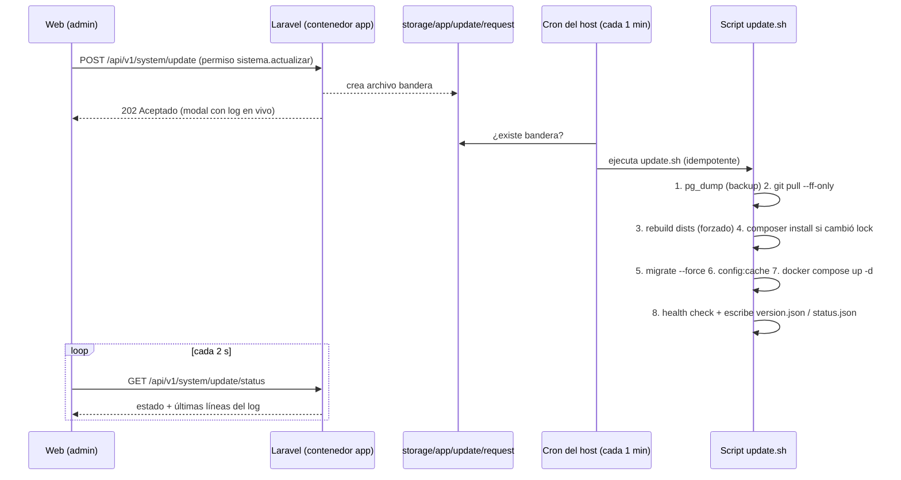

# Ideas — Deploy a VPS "semiproducción" + botón "Actualizar" desde la app

> **Estado:** Fase 0 + Fase 1 **implementadas en el repo** (`deploy/update.sh`,
> `update-cron.sh`, `backup-cron.sh`, `.gitattributes`, guía en DEPLOY.md
> §4.1–4.3). Pendiente en el VPS: migración tarball→git (DEPLOY.md §4.2) +
> cron (§4.3). Fase 2 (botón) sin implementar.
> **Origen:** sesión 2026-09-10. Analiza el código real (docker-compose.yml,
> backend/entrypoint.sh, Dockerfile, seeders, config/permisos.php) y el
> despliegue existente (deploy/DEPLOY.md, deploy/docker-compose.prod.yml)
> antes de redactarse.
> **Idea original:** "quiero subir el sistema a mi VPS y seguir desarrollando;
> cuando esté en la web y el VPS no esté actualizado, quiero un botón que diga
> 'Actualizar' y que se actualice solo, sin romper mis datos ni re-crear las
> migraciones".

---

## 1. Conclusión ejecutiva

**El 80% de la seguridad de datos ya está resuelta en el código actual** —
verificado, no presumido (§2). Lo que falta es un **orquestador de
actualización** (un script idempotente en el host) y un **disparador** (el
botón). La pieza clave del diseño: **la app nunca ejecuta shell ni Docker**;
solo deja una "nota de pedido" (archivo bandera) que un cron del host atiende.
Así el botón no crea superficie de RCE.

Prioridad sugerida: **alta** — es prerrequisito operativo de todo lo demás:
las otras ideas vigentes (tóner, ubicación) y cualquier fix futuro aterrizan
vía este mecanismo.

**Prerrequisito de formato:** el botón depende de que el código llegue por
**git** en el VPS. El repo ya vive en GitHub (`jcgabourelai-svg/redprint-app`,
accesible por https), pero el VPS hoy recibe tarballs (`redprint.tar.gz`,
flujo legacy de DEPLOY.md §4.4): un tarball no puede auto-actualizarse.
Primer paso real: migrar el VPS a git clone preservando los volúmenes
(guía en DEPLOY.md §4.2, pendiente de ejecutar en el VPS).

---

## 2. Lo que YA está resuelto (verificado en código)

| Preocupación original | Estado real | Evidencia |
|---|---|---|
| "Que no re-cree las migraciones" | Resuelto por diseño: `migrate` solo corre archivos **nuevos** no registrados en la tabla `migrations` | mecánica de Laravel |
| "Que no siembre datos demo" | Resuelto: seed solo si la tabla `users` está vacía; si no puede verificar, **omite por seguridad** | `backend/entrypoint.sh:119-139` |
| Migrar en cada reinicio | Resuelto: `RUN_MIGRATIONS=0` omite migrate/seed | `entrypoint.sh:116-139`, compose |
| Deps según entorno | Resuelto: `APP_ENV=production` → `composer install --no-dev` | `entrypoint.sh:96-104` |
| HTTPS detrás de proxy | Resuelto: `PUBLIC_URL` (Traefik/Dokploy existente como único punto público vía `deploy/docker-compose.prod.yml`; puertos ya en 127.0.0.1) | compose `x-app-env`, `nginx`/`database` ports, labels Traefik |
| Persistencia de datos | Resuelto: `pg_data` y `app_storage` son volúmenes nombrados (sobreviven rebuild) | compose `volumes:` |
| Imagen versionada | Parcial: `TAG` ya existe en compose (`redprint-app:${TAG:-latest}`) | compose `app.image` |

---

## 3. Políticas de migración (la respuesta a "no perder datos")

`migrate` protege los datos **siempre que** se cumplan estas políticas. Las
tres primeras son condiciones de validez; la cuarta es la red de seguridad:

1. **Migración aplicada es inmutable.** Nunca editar/renombrar/borrar un
   archivo ya corrido en cualquier entorno. Cambio nuevo = archivo nuevo.
   Editar una ya aplicada no hace nada en esa BD (parece inofensivo) pero
   **diverge** el VPS de un fresh install — el peor bug silencioso.
2. **Nunca `migrate:fresh` / `migrate:refresh` / `db:wipe` en la VPS.** Esos
   comandos borran todo. El script de deploy jamás los incluye; solo existen
   en la máquina local de desarrollo.
3. **Aditivo primero (expand-contract).** Columnas nuevas `nullable` o con
   default; no dropear/renombrar en el mismo release que deja de usarlas.
   Release N agrega/backfillea, release N+1 limpia. Con datos reales de
   clientes esto deja de ser opcional.
4. **`pg_dump` antes de cada actualización**, automático (lo hace el script),
   retención de ~10 backups + backup diario + probar un restore una vez.
   Las políticas 1-3 protegen contra errores de lógica; el backup protege
   contra todo lo demás.

Dato tranquilo extra: los seeders ya son razonablemente seguros (`UserSeeder`
usa `firstOrCreate`) y el gating del entrypoint los omite con datos presentes.

---

## 4. Arquitectura del botón "Actualizar"

Constraint clave: el código vive en el **host** (bind mounts `./backend`,
`./frontend`) y reiniciar contenedores requiere Docker, que el contenedor
`app` **no debe** tener. Montar `docker.sock` en la app = root del host si
comprometen la sesión admin; ejecutar shell desde PHP = superficie de RCE.

Solución: **la app solo escribe un archivo bandera; un cron del host atiende
el pedido ejecutando el mismo script que usarías por SSH**.



Por qué así:

- El endpoint PHP **solo escribe un archivo dentro de `storage/`** — cero
  `exec()`, cero shell, cero docker. Si roban la sesión admin, lo peor que
  puede hacer es disparar una actualización (que de todos modos pasa por
  git + backup).
- El script corre como el usuario del VPS con acceso git/docker, invocado
  **solo vía cron** cada minuto (latencia máx ~60 s: aceptable).
- El mismo script sirve para SSH manual y para un futuro GitHub Action —
  el botón es solo un disparador más del mismo orquestador idempotente.

Canales de comunicación (archivos, no sockets):

- **Pedido:** el endpoint crea `storage/app/update/request` (contenido:
  timestamp + usuario que pidió). El cron lo reclama atómicamente con `mv`
  (sin seguir symlinks) y NUNCA loguea su contenido (el directorio es
  escribible por www-data; un symlink plantado exfiliaría secretos).
- **Estado:** el script escribe `storage/app/update/status.json` (`estado`:
  `inactivo|corriendo|listo|error`, SHA, `inicio`/`fin`, tail del log en
  `update.log`). El endpoint de status lo lee y lo devuelve tal cual.
- **Versión:** el script escribe `storage/app/update/version.json` con el SHA
  resultante. Vive en el volumen `app_storage`: sobrevive reinicios y no
  está en git (necesario porque el contenedor **no ve** el `.git` del repo
  raíz — solo `./backend` está montado; §6-gotcha 3).
- **Mecanismo host↔volumen (decidido):** los cuatro archivos viven en
  `storage/app/update/` dentro del volumen nombrado `app_storage` (NO en el
  árbol del repo). El script del host los lee/escribe con
  `docker compose exec -T`, sin depender del path interno
  `/var/lib/docker/volumes/...`. El directorio lo crea el script y lo deja
  `www-data:www-data` para que Laravel (Fase 2) pueda escribir la bandera;
  los archivos que escribe root quedan legibles por www-data.

---

## 5. El script `update.sh` (pasos + gotchas de ESTE repo)

```bash
1.  Escribir status "corriendo"
2.  docker compose exec database pg_dump -U redprint redprint \
      | gzip > backups/redprint_YYYYmmdd_HHMMSS.sql.gz   # retener ~10
3.  git fetch origin && git pull --ff-only origin main
4.  docker compose run --rm --no-deps frontend sh -c \
      "npm install --no-audit --no-fund && npm run build"    # ídem mobile
5.  docker compose exec app composer install --no-dev \
      --no-interaction --optimize-autoloader
6.  docker compose exec app php artisan migrate --force
7.  docker compose exec app php artisan config:cache \
      && docker compose exec app php artisan route:cache
8.  docker compose up -d    # recrea lo que cambió
9.  curl health check: GET /sanctum/csrf-cookie espera 204
    (no hay /up real: nginx lo resolvería como SPA) → status "listo" + SHA;
    si falla → status "error" (el backup del paso 2 es el plan B documentado)
```

> Implementación real: `deploy/update.sh` (7 pasos, con short-circuit
> "sin cambios" + `FORCE=1`, retención de backups y `flock`; ver DEPLOY.md §4.1).

Gotchas específicos encontrados al verificar el repo:

1. **El builder de frontend NO recompila si `dist/` existe**
   (`docker-compose.yml:26`: `if [ ! -f dist/index.html ]`). En dev protege
   el bug del inodo (D14); en update **hay que forzar** el build como en el
   paso 4. El script de build del package.json ya vacía sin borrar la
   carpeta — D14 respetado.
2. **El entrypoint omite `composer install` si `vendor/` ya existe**
   (`entrypoint.sh:96`: solo instala si falta `vendor/autoload.php`). Tras
   un `git pull` que cambió `composer.lock`, el vendor viejo quedaría — el
   paso 5 es explícito y no confía en el entrypoint.
3. **El contenedor `app` no ve el repo raíz**: solo `./backend` está
   montado, así que el `.git` del proyecto no le es visible. La versión
    actual no puede leerse con git desde PHP → la escribe el script del host
    a `storage/app/update/version.json`.
4. **`git pull --ff-only`** (no `reset --hard`): si el VPS divergió, FALLA
   ruidosamente en vez de descartar cambios. Política hermana: jamás editar
   código a mano en el VPS.
5. **El stack del VPS usa DOS archivos de compose**: todo comando del
   orquestador es `docker compose -f docker-compose.yml -f
   deploy/docker-compose.prod.yml` (override Traefik/Dokploy). Un `docker
   compose` a secas pierde la red `dokploy-network` y el dominio público.
6. **Reinicios explícitos tras el update**: `up -d` solo recrea lo que
   cambió de config/imagen; el código PHP llega por bind mount, así que el
   script reinicia `app`, `scheduler` (omitido en el primer borrado de esta
   idea) y `nginx` (gotcha del inodo de `dist`).
7. **La ventana real de indisponibilidad es el rebuild del dist (paso 3),
   no el `up -d`**: mientras corre `npm run build`, las cargas nuevas de la
   SPA rompen (index viejo referenciando bundles borrados); la API y las
   sesiones ya cargadas siguen vivas. 1–3 min, aceptado en semiproducción.
8. **`exec -T` siempre** (contexto cron sin TTY: los pipes `pg_dump | gzip`
   se colgarían) y **`flock`** al inicio (el cron de 1 min no debe solapar
   una ejecución de 3 min). Guard de CRLF: `.gitattributes` con
   `*.sh text eol=lf` (los scripts se editan en Windows y corren en Linux).

**Sobre `RUN_MIGRATIONS` en la VPS:** ponerlo en `0` y dejar que el paso 6
migre explícitamente. Aunque el entrypoint es seguro (migrate incremental +
seed gated), en producción se quiere decidir cuándo migra y ver su salida en
el log del update, no en un arranque de contenedor.

**Ventana de servicio:** para semiproducción, aceptar 1-2 minutos de
indisponibilidad durante el paso 8 es razonable. Si molesta, envolver con
`php artisan down --retry=30` / `php artisan up` (modo mantenimiento).

---

## 6. El lado de la app (botón, permiso, UX)

- **Permiso nuevo** `sistema.actualizar` en `backend/config/permisos.php`
  (módulo Sistema, junto a `sistema.usuarios` / `sistema.notificaciones` /
  `sistema.configuracion`; verificado: hoy no existe nada de
  versión/actualización en `routes/api.php`).
- **Endpoints delgados** (sin lógica de deploy):
  - `POST /api/v1/system/update` → escribe bandera + 202. `409` si ya hay
    una actualización en curso (status `corriendo`).
  - `GET /api/v1/system/update/status` → lee `status.json` + tail del log.
  - `GET /api/v1/system/version` → lee `version.json`; opcionalmente el
    backend consulta la API de GitHub por el SHA de `origin/main` y devuelve
    `desactualizado: true/false` para habilitar el botón (v2).
- **UX según convenciones del proyecto (§9 de PROJECT.md):** modal de
  confirmación con copy honesto de consecuencias ("se respaldará la base de
  datos; la app puede tardar 1–2 minutos en volver"), panel con el log en
  vivo (polling cada 2 s), estado final con versión nueva o error
  accionable. Entrada en ConfigPage o en el Header junto a la campana.

---

## 7. Diseño por fases

### Fase 0 — Prerrequisitos (sin código de app)

- **El VPS ya está desplegado y sirviendo** (`erp.redprint.cloud` tras
  Traefik/Dokploy, `APP_PORT=8090`, `/opt/redprint`; ver DEPLOY.md §1).
  No hay que instalar nada desde cero.
- Pendiente real: **migrar el VPS de tarball a git** preservando los
  volúmenes nombrados (guía en DEPLOY.md §4.2: mismo path +
  `COMPOSE_PROJECT_NAME=redprint`, verificación de volúmenes y datos).
- Ajuste del `.env` del VPS: `RUN_MIGRATIONS=0` (que migre el orquestador,
  no cada arranque). `APP_ENV=production`, `PUBLIC_URL` y DB real ya están.
- Cron de backup diario (`pg_dump` + retención): `deploy/backup-cron.sh`
  (hecho; instalar con DEPLOY.md §4.3).

### Fase 1 — Orquestador manual (IMPLEMENTADA en el repo; falta ejecutar en el VPS)

- `deploy/update.sh` + `deploy/update-cron.sh` + `deploy/backup-cron.sh`
  con las correcciones de la revisión: compose de dos archivos, `exec -T`,
  `flock`, reinicios explícitos (app/scheduler/nginx), backups en
  `/root/backups` (fuera del árbol de git), pre-flight `git status
  --porcelain`, short-circuit sin cambios + `FORCE=1`, health check contra
  `/sanctum/csrf-cookie`.
- Cron del host cada minuto: instalar con DEPLOY.md §4.3.
- Probar el flujo completo por SSH tocando la bandera a mano (DEPLOY.md §4.3).

### Fase 2 — El botón

- Permiso `sistema.actualizar` en `backend/config/permisos.php` **+
  migración nueva que lo siembre con `Permission::firstOrCreate`** (patrón
  existente: `2026_08_26_000003_create_field_records_table.php::
  seedPermission()`). Sin esa migración, la BD existente del VPS jamás
  aprende el permiso: la migración RBAC `0001...32` ya corrió ahí y no se
  re-ejecuta.
- Los 3 endpoints (§6).
- Frontend: modal de confirmación + panel de log con polling.
- Primera actualización real con una migración trivial de prueba.

### Fase 3 — (opcional) Actualidad visible y disparo externo

- `GET /version` comparando contra GitHub API → badge "desactualizado" y
  botón habilitado solo cuando hay novedad.
- GitHub Action que SSH-ea al VPS y dispara el mismo script en cada push a
  main (CI/CD clásico; el botón queda como override manual).

---

## 8. Salvedades honestas

1. **Semiproducción ≠ producción dura:** single instance, ventana de
   servicio de minutos, sin rollback automático (el restore del pg_dump es
   manual y documentado). Suficiente para el estado actual del negocio.
2. **Latencia del cron:** hasta 60 s entre el click y el arranque del
   script. La UI debe mostrar "esperando al orquestador…" para no parecer
   colgada.
3. **Update fallido a mitad:** el código nuevo puede quedar servido con
   migración a medias. Mitigación por diseño: migrar antes del `up -d`
   final, y las políticas aditivas (§3) hacen que migrate viejo+nuevo
   coexistan. El estado `error` del status incluye el tail del log.
4. **El botón no sustituye el juicio:** si el release cambia `.env`
   (variables nuevas) o el propio compose, hace falta un paso manual — el
   script puede detectar diff en `.env.example`/compose y avisar en el
   status ("actualización requiere atención manual").
5. **Backups en el mismo VPS** protegen contra errores de migración, no
   contra perder el VPS. Copia offsite (aunque sea manual mensual) para lo
   segundo.

---

## 9. Decisiones abiertas (para la discusión)

1. **¿Quién ve el botón?** ¿Solo `administrador` (es_sistema) o también un
   permiso asignable? Recomendación: permiso `sistema.actualizar` solo al
   admin por ahora.
2. **¿Ventana de servicio aceptada o modo mantenimiento `artisan down`
   durante el update?** Recomendación: aceptar la ventana en semiproducción;
   automatizar `down/up` si algún día molesta.
3. **¿Badge de "desactualizado" (v3, requiere GitHub API desde el backend)
   o botón siempre disponible "Actualizar ahora" (idempotente)?**
   Recomendación: empezar sin badge; agregar cuando el repo esté en GitHub.
4. **Retención de backups** (¿10 diarios + 4 semanales?) y ¿copias offsite?
5. **¿Staging separado?** Para semiproducción con datos de prueba reales,
   probablemente no; revisar cuando lleguen datos de clientes de verdad.

---

## 10. Plantilla de evaluación (§11.6 de PROJECT.md)

- **Tipo:** arquitectura / operación (+ UX)
- **Zona:** infraestructura y corteza (un endpoint de sistema); no toca
  núcleo de dominio
- **Invariantes tocadas:** ninguna — no toca dinero, stock ni estados
- **Decisiones tocadas:** extiende el espíritu de idempotencia (D8) al
  deploy; respeta D14 (build que vacía `dist` sin borrar la carpeta)
- **Superficies afectadas:** script host nuevo (`deploy/`), cron del VPS,
  `.env` de producción, backend (3 endpoints + 1 permiso), frontend (modal
  + polling); sin cambios de dominio ni migraciones
- **Riesgo si no se hace:** deploys manuales por SSH propensos a olvidos
  (backup, dist, composer) — cada actualización es una apuesta; el VPS se
  desactualiza y diverge del código local
- **Riesgo si se hace mal:** (a) ejecutar shell/docker desde PHP (RCE);
  (b) montar `docker.sock` en la app; (c) `migrate:fresh` en el VPS;
  (d) olvidar el backup previo; (e) `git reset --hard` que borra cambios
  locales del VPS sin avisar
- **Verificación:** actualizar con una migración nueva trivial (columna
  nullable) y verificar datos intactos, migración aplicada, seed NO corrido,
  dist reconstruido; matar el script a mitad y re-ejecutar (idempotencia);
  restaurar un backup en un entorno limpio al menos una vez
- **Prioridad sugerida:** alta — habilita el ciclo editar → push →
  actualizar para todo lo demás (incluye las ideas de tóner y ubicación)

---

## 11. Mapa de archivos tocados (referencia rápida)

| Superficie | Archivo |
|---|---|
| Compartidos (COMPOSE, APPC, dump+retención) | `deploy/common.sh` (**implementado**) |
| Script orquestador | `deploy/update.sh` (**implementado**) |
| Detector de bandera | `deploy/update-cron.sh` (**implementado**; cron del host cada 1 min) |
| Cron de backup | `deploy/backup-cron.sh` (**implementado**, diario) |
| Guard CRLF | `.gitattributes` (`*.sh text eol=lf`, **implementado**) |
| Guía de operación | `deploy/DEPLOY.md` §4.1–4.3: orquestador, migración tarball→git (preservando volúmenes), cron (**actualizado**) |
| Endpoints | `backend/routes/api.php` + `backend/app/Http/Controllers/System/UpdateController.php` (nuevo, Fase 2) |
| Permiso | `backend/config/permisos.php` (`sistema.actualizar`) **+ migración que lo siembre en BDs existentes** (Fase 2) |
| Lectura de estado | `backend/app/Services/UpdateService.php` (nuevo, Fase 2, delgado: leer `storage/app/update/`) |
| UI | `frontend/src/pages/ConfigPage.tsx` (o Header) + modal de confirmación + panel de log (Fase 2) |
| Compose / env | `.env` del VPS (`RUN_MIGRATIONS=0`, `COMPOSE_PROJECT_NAME=redprint`); sin cambios estructurales al yml |
