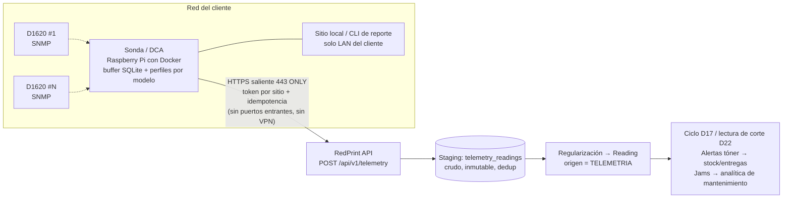

# Ideas — Monitoreo automático de impresoras desde la red del cliente (sonda / DCA)

> **Estado:** propuesta para discusión / implementación futura.
> **Origen:** sesión 2026-09-10. Idea original: "crear un software que se
> encargue de monitorear el consumo de cada impresora directamente desde la red
> de cada cliente… una raspberry económica que se encargue de monitorear las
> impresoras y mandar la información a mi servidor", con varias interfaces
> (API sistema-a-sistema, consola con reporte descargable, sitio local para el
> cliente). Datos a recolectar: conteos, nivel de tóner, historia de atascos.
> Objetivo declarado: **no depender de las visitas físicas para leer contadores**.
>
> **Dato de flota decisivo:** ~90% de la flota real es **Canon imageCLASS
> D1620** (multifuncional mono láser de red). La homogeneidad colapsa el mayor
> riesgo técnico del proyecto: la matriz de compatibilidad SNMP pasa de N
> filas a 1 (ver §4 y §9).
>
> **Regla de oro de este documento:** la telemetría es **otro origen de
> lecturas**, no una nueva fuente de verdad del dinero. Todo pasa por staging +
> regularización en el servidor (mismo espíritu que D15 de PROJECT.md); el
> invariante "una lectura se factura a lo sumo una vez" se mantiene intacto; y
> la telemetría solo alimenta facturación **después** de una fase de validación
> cruzada contra lectura física (§8).

---

## 1. Conclusión ejecutiva

**Viable, técnicamente probado y estratégicamente central.** Esto no es una
idea experimental: es exactamente lo que la industria de MPS (*Managed Print
Services*) lleva 20 años haciendo, y el componente descrito tiene nombre
propio: **DCA (Data Collection Agent)**. Que exista es validación (el modelo
negocio funciona) y a la vez competencia (hay DCAs comerciales white-label:
PaperCut, PrintFleet, FMAudit/ECi, PrinterLogic…).

La ventaja estructural propia frente a los vendors de software: **la flota es
nuestra**. Controlamos modelos, configuración SNMP, instalación (Ethernet) y
rotación. Un vendor MPS pelea contra flotas heterogéreas que no controla;
nosotros no.

Prioridad sugerida: **alta** (toca el costo operativo del dato que alimenta el
fórmula central del negocio), pero con ejecución escalonada: la fase 0 es una
tarde con una impresora del almacén, y nada se automatiza hasta cerrar la
validación cruzada del piloto (§8).

Qué NO es este proyecto: eliminar las visitas. Entregas, mantenimiento y
relación comercial siguen existiendo. Desaparecen las visitas cuyo único
propósito es leer contadores, y las visitas de emergencia evitables (tóner
agotado sin aviso).

---

## 2. Contexto de industria: esto es un DCA de MPS

- **DCA / Data Collection Agent:** pieza de software (o hardware+software) que
  vive en la red del cliente, pollea las impresoras y reporta al servidor del
  proveedor MPS. Es el estándar de facto del rubro.
- Alternativa **build vs. buy**: comprar un DCA white-label acelera semanas,
  pero cobra licencia por dispositivo, su integración con nuestro dominio
  (ciclos D17, tóner → kardex) siempre es incómoda y el roadmap no es nuestro.
- **Canon específico:** el monitoreo remoto oficial de Canon (@Remote) es para
  la línea imageRUNNER enterprise; imageCLASS no tiene oferta equivalente en
  este segmento. **No hay atajo de fabricante que nos estemos perdiendo** —
  refuerza la recomendación de construir agente propio, delgado.
- Construir el core es territorio trillado: SNMP desde Go/Python/Node
  (`gosnmp`, `pysnmp`, `net-snmp`) está más que documentado. Un MVP que pollee
  una flota conocida y homogénea es cuestión de semanas.

---

## 3. Viabilidad técnica: SNMP + flota homogénea

Casi toda impresora láser de red expone telemetría por **SNMP** (v1/v2c/v3)
mediante MIBs estándar (Printer-MIB, RFC 3805; HOST-RESOURCES-MIB) y MIBs
privadas del fabricante (Canon: enterprise OID `1.3.6.1.4.1.1602`; Canon
publica sus MIB files para descargar).

Cobertura esperada por dato — **con el D1620 como caso único a verificar**:

| Dato | Mecanismo | Expectativa D1620 | Comentario |
|---|---|---|---|
| Contador total | Printer-MIB `prtMarkerLifeCount` (`43.10.2.1.4`) | Alta | Es el contador interno del equipo; **verificar contra panel** (§4, Total 1 vs Total 2) |
| Nivel de tóner | `prtMarkerSuppliesLevel` (`43.11.1.1.9`; `-3` = no reporta) | Probable; si no, MIB privada Canon (`1602`) | Alimenta `ideas/niveltoner.md` automáticamente (§6.4) |
| No. de serie | `prtGeneralSerialNumber` (`43.5.1.1.17`) | Casi seguro | Llave para casar contra `printers.num_serie` |
| Estado / error actual | HOST-RESOURCES `25.3.5.1.1` + texto del panel (`43.16.5.1.2`) | Suele funcionar | Atascos *en curso*; base del historial de jams (§7) |
| **Historial de atascos** | Contador OID de jams | **Esperar que NO exista** (típico de imageRUNNER, no imageCLASS) | Solución de diseño: construirlo nosotros (§7) |
| Desglose color/mono | Vendor MIBs | **No aplica**: la D1620 es mono | El problema más irregular de SNMP desaparece solo |
| SNMPv3 | Config del equipo | Por verificar | Si solo v2c: community read-only aleatorizada por sitio |

Complementos posibles: IPP (`Get-Printer-Attributes`) como fallback; portales
cloud de fabricante (HP JetAdvantage, Kyocera Fleet Services) irrelevantes con
flota propia homogénea Canon.

### Aporte específico de la flota homogénea (90% D1620)

1. **La matriz de compatibilidad pasa de N filas a 1.** Un perfil de OIDs,
   probado una vez, aplica a casi toda la flota. Implicación de diseño
   obligatoria: el agente lee **perfiles por modelo** (YAML/JSON), nunca OIDs
   hardcodeados — el segundo modelo que entre (rotación, crecimiento) debe ser
   configuración, no código.
2. **La fase 0 no toca clientes:** hay unidades propias en almacén. Se audita
   en la LAN propia, hoy.
3. **Mono láser = un solo contador:** sin desglose color/mono, la fórmula de
   cobro se alimenta de un número único.
4. **Firmware único = comportamiento único** (ventaja de consistencia), pero
   validar sobre 3–5 unidades con firmwares distintos, no sobre una sola.
5. **Anomalías auto-explicables:** un contador que "retrocede" en flota propia
   casi siempre es swap de equipo/board — y esos eventos ya quedan en
   `printer_histories` (D23). La telemetría puede cruzar contra nuestra propia
   bitácora y auto-justificar la anomalía en vez de generar una alerta muerta
   (ruta de regularización en §11).
6. **Tóner = un solo artículo:** la alerta de nivel bajo mapea a un único
   consumible del catálogo con umbral único; la reposición proactiva se vuelve
   trivial (ver `ideas/niveltoner.md`).

---

## 4. Fase 0: calibración del contador (lo primero, lo más importante)

**Riesgo específico de esta línea Canon:** el panel suele distinguir
**"Total 1" (copia + impresión) y "Total 2" (+ fax)**. Antes de automatizar
nada hay que decidir cuál es *nuestro* contador de facturación y verificar que
el OID SNMP devuelve **exactamente el mismo número que hoy capturan los socios
del panel**. Si la telemetría mide un contador distinto al que se ha cobrado
históricamente, generamos disputas con nuestros propios datos.

Checklist sobre 3–5 unidades del almacén (firmwares distintos si es posible):

- [ ] Abrir Remote UI (`http://<IP>` — existe en esta línea) y anotar
      contadores del panel y nivel de tóner: es la prueba de concepto mínima,
      cero herramientas.
- [ ] `snmpwalk` de los OIDs candidatos (abajo) desde un contenedor Docker con
      net-snmp (en Windows no hay snmpwalk nativo; el contenedor alcanza la LAN
      por NAT saliente de Docker Desktop — coherente con el flujo Docker del
      proyecto, AGENTS.md).
- [ ] Comparar OID contador vs panel en cada unidad: **diferencia cero**.
- [ ] Decidir Total 1 vs Total 2 como contador de facturación (§11.2).
- [ ] Verificar OID de nivel de tóner (si `43.11.1.1.9` no responde, volcar la
      MIB privada `1602` y mapear).
- [ ] Verificar OID de número de serie contra `printers.num_serie` real.
- [ ] Probar SNMPv3 (¿lo soporta bien?); si no, plan v2c read-only con
      community aleatorizada por sitio.
- [ ] Anotar el resultado como **perfil del modelo D1620** (YAML) — primer
      insumo real del agente.
- [ ] Confirmar el 10% restante de la flota: qué modelos son, para dimensionar
      cuántos perfiles más habrá.

Comandos de sondeo:

```
snmpwalk -v2c -c public <IP> 1.3.6.1.2.1.43.10.2.1.4   # contador total (Printer-MIB)
snmpwalk -v2c -c public <IP> 1.3.6.1.2.1.43.11.1.1.9   # nivel de consumibles
snmpwalk -v2c -c public <IP> 1.3.6.1.2.1.43.5.1.1.17   # número de serie
snmpwalk -v2c -c public <IP> 1.3.6.1.2.1.25.3.5.1.1    # estado / error actual
snmpwalk -v2c -c public <IP> 1.3.6.1.2.1.43.16.5.1.2   # texto del panel (jam en curso)
snmpwalk -v2c -c public <IP> 1.3.6.1.4.1.1602          # volcado MIB privada Canon
```

---

## 5. Arquitectura propuesta

El patrón estándar de la industria, adaptado a nuestro stack:



Decisiones de diseño clave:

1. **Push, nunca pull.** La sonda inicia la conexión HTTPS saliente al
   servidor. Elimina el 90% de las objeciones de TI del cliente: no hay
   puertos abiertos, no hay VPN, no hay acceso entrante a su red. Ancho de
   banda trivial (KBs por poll).
2. **Un solo código, dos empaquetados:** imagen Docker para Raspberry Pi
   (Pi Zero 2 W / Pi 4, o thin client usado) y — después — servicio Windows
   para clientes que prefieran "nada extra conectado". Empezar con el Pi.
3. **Buffer local + idempotencia.** La sonda guarda lecturas en SQLite y
   reintenta ante caídas de red; el server deduplica por
   (`impresora_serie`, `medido_en`). Mismo patrón anti-reintento que ya
   resolvió `FieldRecordService` con `client_uuid` (§10 móvil de PROJECT.md:
   lecturas manuales siguen sin esa unicidad — la telemetría nace con ella).
4. **Perfiles por modelo como configuración** (§3.3.1): el agente no conoce
   OIDs, conoce perfiles; el perfil D1620 es el primero.
5. **Heartbeat:** la sonda reporta "sigo vivo" cada N horas. El silencio es
   una alerta del server: "sitio sin reportar >48h" → visita de recuperación.
   El flujo del operador no se elimina, se convierte en excepción (§8).

Las **tres interfaces** de la idea original, mapeadas:

| Interfaz | Diseño |
|---|---|
| **API sistema-a-sistema** | `POST /api/v1/telemetry/...` con **token por sitio** (auth de máquina; NO Sanctum cookie, que es auth de usuario same-origin) |
| **Consola / reporte descargable** | CLI en la propia sonda (`reporte --desde --hasta --csv`): trivial una vez que el poller existe; sirve para "el cliente me pide su conteo" sin tocar el server |
| **Sitio local para el cliente** | Servidor web pequeño en la sonda (solo LAN del cliente). Da visibilidad al cliente **sin abrir el portal de cliente en el SaaS** — que hoy es decisión explícita fuera de alcance (PROJECT.md §2). Así no hay que revertirla |

---

## 6. Integración con el dominio RedPrint

El sistema ya tiene los engranajes listos para consumir esta data:

### 6.1 Staging + regularización (extensión de D15)

La telemetría es conceptualmente "otro origen de registros, sin humano": tabla
staging cruda e inmutable (`telemetry_readings`: sitio, serie, `medido_en`,
contador, niveles, estado, eventos) → regularización a `Reading` con
`origen = TELEMETRIA`. Mismo patrón que `FieldRecord` (capturar ≠ registrar).

**Tensión de modelo a resolver (importante):** hoy las lecturas nacen de
visitas (`Visit ||--o{ Reading`). La lectura telemétrica no tiene visita.
Opciones:

- (a) `visita_id` **nullable** + `origen=TELEMETRIA` — **recomendado**:
  conserva el invariante "una lectura se factura a lo sumo una vez" (el índice
  único parcial sobre `invoice_details.lectura_id` sigue aplicando) y
  `paginas_periodo` se calcula igual.
- (b) Tomar la lectura de corte directo del staging sin fila en `readings` —
  **descartado**: rompe el invariante de facturación única y el cálculo
  estándar de `paginas_periodo`.

### 6.2 Facturación por ciclos (D17/D22)

La telemetría puede alimentar la **lectura de corte automáticamente**:
última lectura del ciclo en la ventana `[fin − 5, fin + dias_gracia]`
(D22), respetando el arrastre de consumo. Ninguna matemática de ciclos nueva:
`CicloFacturacion` sigue siendo la única fuente.

### 6.3 Anomalías

Contador a la baja (swap de board/equipo): el flujo de anomalía con
justificación ya existe. Para telemetría, la anomalía se **marca para
revisión, no para consumo automático**, con auto-sugerencia cruzando
`printer_histories` (§3.3.5). Bandeja de regularización, espíritu D15.

### 6.4 Tóner → sinergia directa con `ideas/niveltoner.md`

El campo `niveles_toner` (jsonb) propuesto ahí queda **poblado automáticamente**
por la sonda para sitios monitoreados — la captura manual del operador sigue
existiendo para sitios sin sonda. Todo el análisis de `niveltoner.md`
(pendiente de consumo, páginas restantes, rendimiento real, costo por página
con insumo = pregunta abierta §11.3.1 de PROJECT.md) mejora sus datos de
entrada: nivel medido por SNMP en vez de estimado a ojo con pasos de 25%.

### 6.5 Atascos → sinergia con `ideas/tecnico-mantenimiento.md`

El historial de jams construido por la sonda (§7) alimenta la analítica de
fallas de ese documento (`tipo_problema ATASCOS` hoy solo existe en órdenes
creadas manualmente). La sonda convierte "qué falla más" en dato medido.

### 6.6 Consumo desbordado a mitad de ciclo

Con lecturas diarias en vez de mensuales: cliente que va muy por encima del
paquete → aviso informativo **antes** de la sorpresa de la factura. Señal
comercial (upsell) y de relación (transparencia), no bloqueo.

### 6.7 Visitas y scheduler

Nada cambia en `VisitSchedulerService` (la frecuencia es configuración del
contrato). Con telemetría, la decisión comercial es bajar frecuencia y/o
cambiar el propósito de la visita (entrega/mantenimiento en vez de lectura) —
gradual, por cliente (§11.5).

---

## 7. El hueco de "historia de atascos" tiene solución de diseño

Aunque la D1620 probablemente no exponga un contador histórico de jams, **el
agente puede construirlo**: polling de estado cada 5–15 minutos + registro de
transiciones (OK → "paper jam" → OK) acumula un historial propio de atascos
**con duración incluida** — algo que ni siquiera los counters nativos dan.
La limitación del hardware se convierte en una feature del agente. La
frecuencia fina (estado) es separada de la de contadores (4–24 h): dos ritmos,
un mismo reporte.

---

## 8. Confiabilidad: del dato SNMP a la facturación

Qué puede fallar y cómo se blinda:

1. **Silencio de la sonda** (Pi desconectada, SD muerta, cliente desenchufó):
   heartbeat → alerta "sitio sin reportar >48h" → visita física de
   recuperación. El operador queda como excepción, no como rutina.
2. **IPs que cambian (DHCP):** descubrimiento por número de serie, o reserva
   DHCP al instalar (nosotros instalamos, nosotros configuramos).
3. **Impresoras apagadas de noche:** poll en horario hábil.
4. **Confianza para facturar — fase obligatoria de validación cruzada:**
   1–2 ciclos completos comparando telemetría vs. lectura física del operador
   **con diferencia cero** antes de habilitar la lectura de corte automática.
   El dato SNMP es el contador interno del equipo (el mismo que se lee en el
   panel hoy): una vez calibrado (§4), es *más* confiable que la transcripción
   manual — elimina error de digitación y agrega timestamp.
5. **Desputabilidad:** snapshot timestamped del contador + sitio local donde
   el cliente ve su propio número → las disputas de "no imprimí tanto" se
   reducen drásticamente.

Fricción de clientes, honesta por segmento (§ abajo) y seguridad:

| Segmento | Fricción | Objeción típica | Mitigación |
|---|---|---|---|
| PYME/oficina sin TI (nuestro nicho) | **Baja** | "¿Esto ve lo que imprimo?" | Respuesta clara: solo contadores y niveles, jamás contenido de documentos. La conecta el técnico en la instalación |
| Cliente con departamento de TI | Media-alta | Cuestionario de seguridad, VLAN, proxy con CA propia, "nada de dispositivos externos" | One-pager de seguridad (solo HTTPS saliente, SNMP read-only, sin almacenamiento de documentos), soporte de proxy corporativo en el agente, y la opción software-instalable |
| Cliente que se niega | Real | — | No se pierde: la lectura física sigue existiendo. Modelo híbrido por cliente |

Datos a favor en México/PYME: SNMP con community `public` suele venir
habilitado de fábrica; el pitch positivo es fuerte ("nunca más sin tóner, y
ves tu propio consumo"). El **comodato** del dispositivo y su recuperación al
terminar el contrato deben quedar clausulados (§11.6).

La opción "app en la PC del cliente" es la de **más** fricción (antivirus,
políticas, PC apagada de noche): fallback, no vía principal.

---

## 9. Diseño por fases

| Fase | Qué | Inversión | Criterio de salida |
|---|---|---|---|
| **0 — Auditoría D1620** | §4 completo: Remote UI + snmpwalk sobre 3–5 unidades de almacén; calibración contador; perfil YAML del modelo | Una tarde, $0 | OID contador == número del panel en todas las unidades; decisión Total 1/Total 2 tomada |
| **1 — Poller script → API** | Script (Go o Python) que pollea e ingiere por `POST /telemetry` a staging; probar desde la oficina en 1–2 sitios propios | 1–2 semanas | Data fluyendo sin hardware en cliente; dedup idempotente probado |
| **2 — Piloto sonda** | 3–5 clientes afines; Pi con Docker; heartbeat; **validación cruzada 1–2 ciclos** | 1–2 meses | Diferencia telemetría vs panel = 0 en los ciclos del piloto |
| **3 — Automatización** | Lectura de corte automática (D17/D22) tras validar; tóner → alertas/entregas proactivas (`niveltoner.md` F3); jams → analítica (`tecnico-mantenimiento.md`) | — | Primera factura con lectura de corte automática aceptada sin disputa |
| **4 — Interfaces** | CLI de reporte local; mini sitio local del cliente; API sistema-a-sistema documentada | — | Reporte descargable pedido por un cliente real, servido por la sonda |

Orden no negociable: **nada de la fase 3 sin cerrar la fase 2** (§8.4).

---

## 10. Números orientativos (para la decisión de negocio)

- Sonda con Pi + SD + fuente + caja: orden de **$1,200–1,800 MXN** por sitio.
  Usar SD industrial/A2 (las SD consumer mueren; es el RMA #1).
- Visita de lectura marginal (tiempo + traslado): orden de $150–300 MXN. A 12
  visitas/año por cliente: **payback 4–8 meses** solo por lecturas; menos si
  evita 2–3 visitas de emergencia de tóner al año.
- **Costo operativo nuevo** (no subestimar): provisionar/flashear, RMA anual
  de SDs, recuperar el equipo al churn. Es logística de hardware real, con
  % de bajas anual. El comodato y el depósito amortiguan.
- No todas las visitas desaparecen: desaparecen las visitas de-solo-lectura y
  parte de las de emergencia. Las de entrega/mantenimiento/relación quedan.

---

## 11. Decisiones abiertas (para la discusión)

1. **Empaque inicial de la sonda:** Pi (Docker) primero vs servicio Windows.
   Recomendación: Pi; Windows después con el mismo código.
2. **Definición del contador de facturación:** Total 1 (copia+impresión) vs
   Total 2 (+ fax). Recomendación: el que hoy capturan los socios; se decide
   con la calibración de fase 0.
3. **Modelo de la lectura telemétrica:** `visita_id` nullable +
   `origen=TELEMETRIA` (recomendado, §6.1) vs alternativas. Migración de
   `readings` implicada.
4. **Ventana de validación antes de facturar con telemetría:** ¿1 ciclo? ¿2?
   Recomendación: 2 ciclos completos con diferencia cero vs panel.
5. **Frecuencia contractual cuando la lectura es automática:** ¿bajar
   frecuencia de visitas? La visita tiene valor de relación/presencia —
   decisión comercial, no técnica. Recomendación: mantener propósito, bajar
   frecuencia gradualmente por cliente.
6. **Propiedad del dispositivo:** comodato en contrato + ¿depósito?
   Recomendación: comodato explícito clausulado; recuperación al churn.
7. **Autenticación de la sonda:** token bearer por sitio vs mTLS.
   Recomendación: token por sitio en v1; mTLS si algún cliente TI lo exige.
8. **SNMP:** v3 si la D1620 lo soporta bien (fase 0 decide); si no, v2c
   read-only con community aleatorizada por sitio.
9. **Frecuencia de polling:** contadores cada 4 h; estado cada 10 min (para
   jams, §7). Ajustar con ruido real del piloto.
10. **¿Sitio local (fase 4) o solo reporte descargable?** Recomendación:
    reporte primero (más simple), sitio local si los clientes lo piden.
11. **¿Repo de la sonda dentro de redprint-app (`sonda/`) o repo aparte?**
    Recomendación: repo aparte (ciclo de vida y despliegue distintos:
    imagen Docker ARM vs stack Laravel), referenciado desde aquí.

---

## 12. Riesgos y salvedades honestas

1. **Los OIDs de §3/§4 son expectativa de literatura, no medición propia.**
    La fase 0 existe exactamente para convertir esa tabla en evidencia. Nada
    de este documento debe citarse como verificado hasta entonces.
2. **El 10% restante de la flota** necesitará perfiles propios; el diseño por
    perfiles lo absorbe, pero hay que identificar esos modelos (checklist
    fase 0).
3. **Impresoras instaladas por USB no son polleables** por SNMP. Como
    nosotros instalamos, la política es simple: *toda instalación con
    Ethernet* (o Wi-Fi de la red del cliente). Auditar instalaciones actuales.
4. **La D1620 es un modelo veterano:** al rotar la flota hacia sucesores, los
    perfiles se extienden (config, no código) pero hay que mantener el hábito
    de calibrar contador nuevo vs panel.
5. **Quitar la lectura quita "ojos en el sitio":** la telemetría compensa
    parcialmente (estados, jams, tóner) pero la visita física tiene valor de
    relación y detección temprana. Es un trade-off comercial a gestionar,
    no un win gratis (§11.5).
6. **Privacidad:** solo contadores/niveles/estados, jamás contenido de
   documentos. Ese mensaje (y el one-pager de TI) debe ser parte del despliegue,
   no una ocurrencia.
7. **El poller de fase 1 desde la oficina** sirve para validar data, pero la
   sonda final vive en la red del cliente: no confundir los entornos de
   prueba (oficina/Docker Desktop) con el entorno de producción (Pi en sitio).
8. **Dedup nace con la telemetría, no retrocede:** el hueco conocido de
   unicidad server-side por (visita, impresora) en lecturas manuales (§10
   móvil de PROJECT.md) sigue abierto para el flujo humano; la telemetría no
   lo empeora pero tampoco lo arregla.

---

## 13. Plantilla de evaluación (§11.6 de PROJECT.md)

- **Tipo:** negocio + arquitectura
- **Zona:** nueva superficie periférica (sonda en sitio) que alimenta núcleo
  de dominio (lecturas → facturación) vía staging
- **Invariantes tocadas:** conserva "una lectura se factura a lo sumo una
  vez" (staging + dedup server-side por serie+`medido_en`; `visita_id`
  nullable con `origen=TELEMETRIA` mantiene el índice único
  lectura↔detalle); anomalías de telemetría → revisión, no consumo
- **Decisiones tocadas:** **extiende** D15 (staging + regularización, ahora
  sin humano); **alimenta** D17/D22 (lectura de corte automática tras
  validación); sinergia con `ideas/niveltoner.md` (tóner automático) y
  `ideas/tecnico-mantenimiento.md` (jams medidos); **revisita parcialmente**
  "No hay portal del cliente" (PROJECT.md §2) resuelto con sitio local en la
  sonda, sin abrir el SaaS
- **Superficies afectadas:** repo nuevo (sonda: poller SNMP, perfiles por
  modelo, buffer SQLite, cliente HTTPS, CLI, sitio local) + backend
  (migración staging + `readings.visita_id` nullable + enum origen, endpoint
  `POST /telemetry` con token de sitio, `TelemetryService` dedup,
  regularización) + notificaciones/dashboard
- **Riesgo si no se hace:** dependencia total de visitas físicas para el dato
  que alimenta el 100% de los ingresos; costo operativo creciente lineal con
  clientes; sin visibilidad de tóner/jams hasta que el cliente reclama
- **Riesgo si se hace mal:** (a) facturar sobre telemetría sin validación
  cruzada; (b) contador SNMP ≠ contador del panel (Total 1 vs Total 2) →
  disputas con datos propios; (c) diseño pull/VPN que dispara objeciones de
  TI; (d) subestimar la logística de hardware (provisioning, RMA, recuperación
  al churn); (e) OIDs hardcodeados en vez de perfiles por modelo
- **Verificación:** fase 0 (calibración OID vs panel en 3–5 unidades, §4);
  tests de dedup idempotente del ingest; validación cruzada 1–2 ciclos en
  piloto antes de habilitar lectura de corte automática;
  `docker compose exec app php artisan test`
- **Prioridad sugerida:** alta — toca el costo operativo del dato que
  alimenta la fórmula central (`monto = tarifa + excedente × páginas`); pero
  ejecución escalonada: fase 0 esta semana, nada automático antes del piloto

---

## 14. Mapa de superficies tocadas (referencia rápida)

| Superficie | Lugar (nombres tentativos hasta diseñar) |
|---|---|
| Sonda (repo aparte, §11.11) | poller SNMP + perfiles por modelo (YAML) + buffer SQLite + cliente HTTPS + CLI de reporte + sitio local |
| Perfil de modelo | `perfiles/canon-d1620.yaml` (nace de la fase 0) |
| Migración staging | `backend/database/migrations/*_create_telemetry_readings_table.php` + tabla de sitios/tokens |
| Migración lecturas | `backend/database/migrations/*_make_visita_id_nullable_add_origen_to_readings_table.php` |
| Endpoint ingest | `backend/routes/api.php` → `POST /api/v1/telemetry` (token de sitio, sin Sanctum cookie) |
| Servicio ingest | `backend/app/Services/TelemetryService.php` (dedup idempotente por serie+`medido_en`) |
| Regularización | extensión del patrón D15: telemetría → `Reading` `origen=TELEMETRIA` (`ReadingService::captureReading` como referencia) |
| Alertas tóner | alimenta `niveles_toner` y `TonerService` de `ideas/niveltoner.md` |
| Analítica jams | alimenta §2 de `ideas/tecnico-mantenimiento.md` |
| Heartbeat | scheduler del server: "sitio sin reportar >48h" → notificación |
